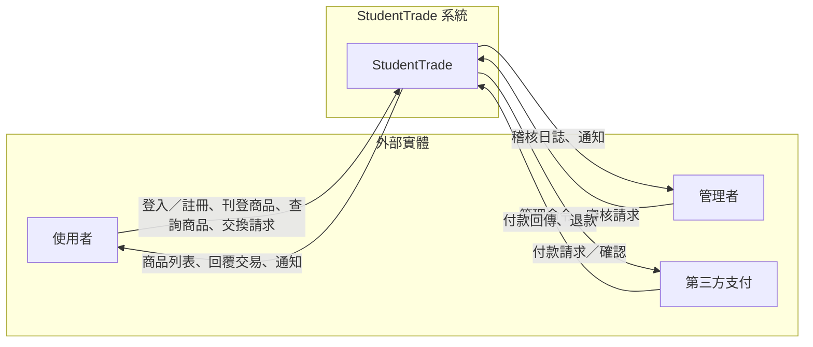

## DFD 與系統環境圖 (Context Diagram)

此文件包含 StudentTrade 系統的系統環境圖（DFD Context）與 DFD 圖0（Level 0）。請將此檔案的 GitHub 連結貼到教學網討論區。

---

### GitHub 連結

請將此檔案在 GitHub 上的 URL 貼到教學網討論區：

`https://github.com/<你的帳號>/StudentTrade/blob/main/dfd.md`

（請替換 `<你的帳號>` 為你在 GitHub 的帳號）

---

## 系統環境圖（Context Diagram - DFD Level: Context）

下圖描述 StudentTrade 與外部實體之間的主要資料流：



說明：
- 外部實體：使用者（買/賣）、系統管理者、第三方支付平台。
- 主要資料流包含：使用者與系統之間的帳號、商品、交換請求、通知與交易資訊。

---

## DFD 圖0（Level 0）

下圖為 Level 0（圖0）示意圖，至少包含三個以上的處理程序（Process）：

```mermaid
flowchart TB
  %% External entities
  User[使用者]
  Payment[第三方支付]
  Admin[管理者]

  %% Processes
  P1[(P1) 使用者管理]
  P2[(P2) 商品管理]
  P3[(P3) 交易與交換處理]
  P4[(P4) 通知與日誌]

  %% Data stores
  DS1[(D1) 使用者資料庫]
  DS2[(D2) 商品資料庫]
  DS3[(D3) 交易記錄]

  %% Flows
  User -->|註冊/登入/更新資料| P1
  P1 -->|讀取/寫入| DS1

  User -->|刊登/查詢/下架商品| P2
  P2 -->|讀取/寫入| DS2

  User -->|提出交換/購買請求| P3
  P3 -->|建立/更新| DS3
  P3 -->|付款請求| Payment
  Payment -->|付款結果| P3

  P3 -->|交易結果、通知| P4
  P2 -->|商品變動通知| P4
  P1 -->|帳號異動通知| P4
  P4 -->|訊息/Email/系統日誌| Admin

  Admin -->|管理/審核| P2
  Admin -->|稽核| P3

```

說明：
- P1 使用者管理：處理註冊、登入、帳號更新與驗證。
- P2 商品管理：處理刊登、修改、下架、查詢商品。
- P3 交易與交換處理：處理交換請求、付款請求、交易完成與交易記錄。
- P4 通知與日誌：負責發送系統通知、Email、以及記錄系統日誌。

資料庫（Data Stores）至少包含使用者、商品與交易記錄三個資料庫。

---

## 教學網討論區貼文範本（可直接複製）

標題：StudentTrade - DFD：系統環境圖（Context）與 DFD 圖0

內容：

各位助教／同學好，

我已在 GitHub 上新增 StudentTrade 的 DFD（系統環境圖與 DFD 圖0）：

檔案連結：

`https://github.com/<你的帳號>/StudentTrade/blob/main/dfd.md`

（請將 `<你的帳號>` 換成你的 GitHub 帳號）

摘要：
- 系統環境圖（Context）說明系統與外部實體之間的主要資料流。
- DFD 圖0（Level 0）包含 P1 使用者管理、P2 商品管理、P3 交易與交換處理、P4 通知與日誌（共 4 個程序，超過 3 個的需求）。

若需要我把圖片匯出並附上 PNG 檔，或是轉成 PDF，請告訴我我會額外上傳。

謝謝！

---

## 備註

1. Mermaid 圖可直接在支援 Mermaid 的 Markdown 渲染器（例如 GitHub）中顯示。若教學網不支援 Mermaid，可先把圖輸出為圖片再上傳。
2. 我已在檔案中提供可修改的 GitHub 連結模板（請替換帳號）。
