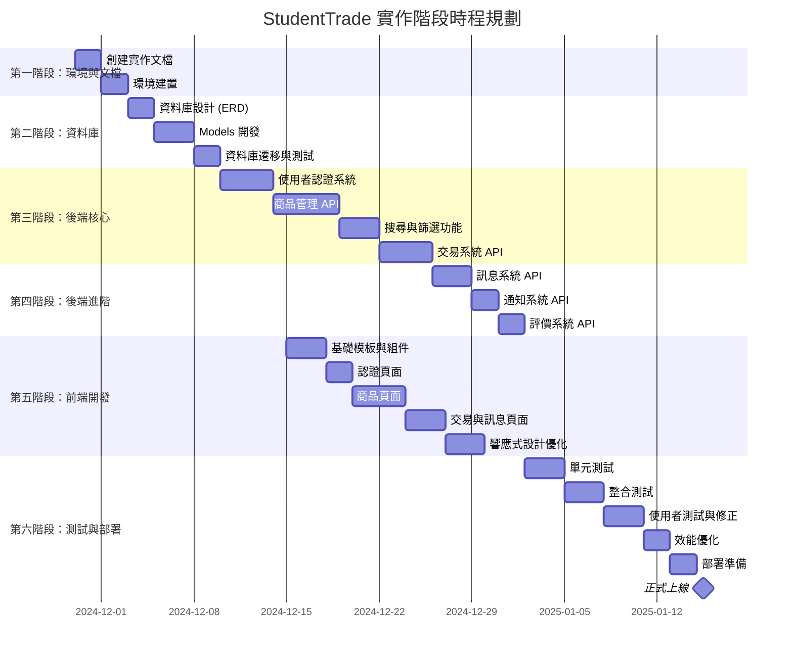
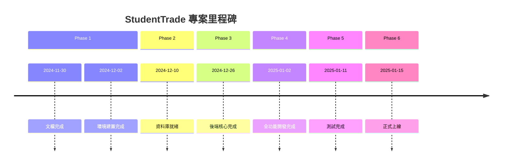

# StudentTrade 實作總體規劃

## 一、專案概述

### 1.1 專案簡介

**專案名稱**: StudentTrade 校園二手物品交換平台
**開發團隊**: 第十二組
**團隊成員**:
- 組長：林威辰（系統實作與測試負責人）
- 組員：陳浚瑋（系統分析師）
- 組員：范哲瑋（系統設計師）

**專案目標**: 提供學生在校園內進行二手物品的上架、搜尋、交換與交易，支援書籍、文具、電子產品與生活用品等類別。

### 1.2 專案現況

**已完成的工作**:
- ✅ 需求分析（功能性與非功能性需求）
- ✅ 系統環境圖與 DFD Level 0
- ✅ Use Case 圖與詳細說明
- ✅ UML 類別圖、循序圖、活動圖
- ✅ 專案時程規劃（甘特圖、PERT/CPM）

**待實作的工作**:
- ❌ 資料庫設計與實作（ERD、Schema、資料建立）
- ❌ 後端 API 開發（Flask 應用程式）
- ❌ 前端介面開發（Jinja2 模板 + Tailwind CSS）
- ❌ 系統測試與優化
- ❌ 部署與上線

---

## 二、技術棧確定

### 2.1 技術選型

| 技術層 | 技術選擇 | 版本 | 說明 |
|--------|---------|------|------|
| **前端框架** | Tailwind CSS | 4.1 | Utility-first CSS 框架 |
| **模板引擎** | Jinja2 | 3.x | Flask 內建模板引擎 |
| **後端框架** | Flask | 3.x | Python 輕量級 Web 框架 |
| **ORM** | SQLAlchemy | 2.x | Python ORM 工具 |
| **資料庫** | PostgreSQL | 16 | 關聯式資料庫 |
| **程式語言** | Python | 3.11+ | 後端開發語言 |
| **套件管理** | pip | - | Python 套件管理工具 |
| **Node 工具** | npm/pnpm | - | Tailwind CSS 編譯 |

### 2.2 技術選型理由

#### Flask (Monolithic 架構)
**選擇理由**:
- 團隊規模小（3 人），適合採用一體式架構
- 開發效率高，學習曲線平緩
- Jinja2 模板與 Tailwind CSS 整合良好
- 部署簡單，資源需求低
- 適合中小型專案快速原型開發

**架構特點**:
- 前後端一體（Server-Side Rendering）
- Blueprint 模組化路由設計
- SQLAlchemy ORM 資料存取
- Session-based 使用者認證

#### PostgreSQL 16
**選擇理由**:
- 強大的資料完整性保證（ACID）
- 支援全文搜尋功能（適合商品搜尋）
- JSONB 資料型態提供彈性擴展
- 良好的效能與可擴展性
- 豐富的社群資源與文檔

#### Tailwind CSS 4.1
**選擇理由**:
- Utility-first 設計快速開發 UI
- 高度可客製化，符合設計需求
- JIT 編譯器優化 CSS 檔案大小
- 響應式設計（RWD）實現簡單
- 與 Flask 模板整合容易

### 2.3 開發環境需求

**必要軟體**:
- Python 3.11 或更新版本
- PostgreSQL 16
- Node.js 18+ (用於 Tailwind CSS 編譯)
- Git 版本控制

**推薦工具**:
- Visual Studio Code (IDE)
- Postman (API 測試)
- DBeaver (資料庫管理)
- pgAdmin 4 (PostgreSQL 管理)

---

## 三、系統功能範圍

### 3.1 核心功能 (P0 - 必須完成)

#### F1: 使用者管理
- 使用者註冊（Email、學號驗證）
- 使用者登入/登出
- 個人資料管理（編輯資料、上傳頭像）
- Session 管理與認證

#### F2: 商品管理
- 商品刊登（標題、描述、價格、狀況、分類、圖片）
- 商品列表瀏覽（分頁顯示）
- 商品詳情查看
- 商品編輯與刪除（僅限擁有者）
- 我的商品列表

#### F3: 搜尋與篩選
- 關鍵字搜尋（商品標題、描述）
- 分類篩選
- 價格範圍篩選
- 商品狀況篩選
- 搜尋結果排序

#### F4: 交易系統
- 發起交易請求
- 賣家接受/拒絕交易
- 交易狀態追蹤
- 完成交易確認

### 3.2 重要功能 (P1)

#### F5: 訊息系統
- 使用者間私訊
- 訊息列表與對話歷史
- 未讀訊息提示
- 商品諮詢留言

#### F6: 通知系統
- 交易狀態通知
- 新訊息通知
- 系統公告通知

#### F7: 評價系統
- 交易完成後評價
- 評分機制（1-5 星）
- 評價內容顯示
- 使用者信譽積分

### 3.3 增強功能 (P2 - 時間允許再實作)

#### F8: 圖片管理
- 多圖上傳
- 圖片壓縮與優化
- 圖片輪播展示

#### F9: 收藏與關注
- 收藏商品功能
- 關注賣家功能
- 我的收藏列表

### 3.4 可選功能 (P3)

#### F10: 管理員後台
- 商品審核管理
- 使用者管理
- 系統數據統計

---

## 四、開發時程規劃

### 4.1 時程總覽 (Gantt Chart)

### 4.2 關鍵里程碑

### 4.3 團隊分工

| 階段 | 林威辰（實作） | 陳浚瑋（分析） | 范哲瑋（設計） |
|------|-------------|-------------|-------------|
| **環境建置** | 主責：Python、PostgreSQL 環境 | 協助：需求確認 | 協助：前端工具設置 |
| **資料庫實作** | 主責：Models 開發、遷移 | 協助：資料驗證規則 | 主責：ERD 設計 |
| **後端開發** | 主責：API 開發、業務邏輯 | 協助：功能測試 | 協助：介面對接 |
| **前端開發** | 協助：模板整合 | 協助：內容審核 | 主責：UI/UX 設計 |
| **測試** | 主責：測試案例、Bug 修復 | 協助：功能驗收 | 協助：UI 測試 |
| **文檔** | 技術文檔 | 需求文檔 | 設計文檔 |
| **部署** | 主責：伺服器部署 | 協助：數據準備 | 協助：靜態資源 |

---

## 五、風險管理

### 5.1 技術風險

#### 風險 1: Tailwind CSS 4.1 相容性問題
**可能性**: 中
**影響**: 中
**應對策略**:
- 提前測試 Tailwind 4.1 的新特性
- 準備降級到 Tailwind 3.4 的備案
- 使用穩定的 CDN 版本作為後備

#### 風險 2: PostgreSQL 效能瓶頸
**可能性**: 低
**影響**: 高
**應對策略**:
- 合理設計資料表索引
- 使用查詢優化技術（EXPLAIN ANALYZE）
- 實施分頁查詢避免大量資料載入
- 適當使用快取機制

#### 風險 3: 圖片上傳與儲存問題
**可能性**: 中
**影響**: 中
**應對策略**:
- 限制上傳檔案大小（< 5MB）
- 使用 Pillow 進行圖片壓縮
- 本地儲存 + 檔案命名策略
- 考慮使用雲端儲存（時間允許）

### 5.2 時程風險

#### 風險 4: 開發時程延誤
**可能性**: 高
**影響**: 高
**應對策略**:
- 採用 MVP（最小可行產品）策略
- 優先完成 P0 核心功能
- P2/P3 功能視時間彈性調整
- 每週進行進度檢討會議

#### 風險 5: 團隊成員時間衝突
**可能性**: 中
**影響**: 中
**應對策略**:
- 提早確認每位成員的可用時間
- 採用異步協作方式（Git、文檔）
- 設定明確的交付時間點
- 使用看板追蹤進度

### 5.3 品質風險

#### 風險 6: 測試覆蓋率不足
**可能性**: 中
**影響**: 高
**應對策略**:
- 採用 TDD（測試驅動開發）
- 邊開發邊撰寫測試案例
- 使用 pytest 進行自動化測試
- Code Review 確保程式碼品質

---

## 六、品質保證策略

### 6.1 編碼規範

**Python 編碼規範**:
- 遵循 PEP 8 風格指南
- 使用 Black 自動格式化
- 使用 Flake8 進行靜態檢查
- 使用 isort 整理 import 順序

**命名規範**:
- 變數與函數：snake_case
- 類別：PascalCase
- 常數：UPPER_SNAKE_CASE
- 私有屬性：_leading_underscore

**註解規範**:
- 使用 docstring 描述函數與類別
- 複雜邏輯必須加上註解說明
- 避免無意義的註解

### 6.2 測試策略

**測試層級**:
1. **單元測試（Unit Tests）**
   - 測試個別函數與方法
   - 使用 pytest 框架
   - 目標覆蓋率 > 70%

2. **整合測試（Integration Tests）**
   - 測試 API 端點
   - 測試資料庫操作
   - 測試業務邏輯流程

3. **使用者驗收測試（UAT）**
   - 真實使用者操作流程
   - UI/UX 體驗測試
   - 跨瀏覽器測試

**測試工具**:
- pytest（Python 測試框架）
- pytest-flask（Flask 測試工具）
- pytest-cov（覆蓋率報告）

### 6.3 Code Review 機制

**Review 流程**:
1. 開發者在功能分支完成開發
2. 提交 Pull Request 到 main 分支
3. 至少一位成員進行 Code Review
4. 通過 Review 後才能合併

**Review 檢查項目**:
- 程式碼符合規範
- 邏輯正確無誤
- 效能考量
- 安全性檢查
- 測試案例完整

---

## 七、部署策略

### 7.1 部署環境

**開發環境（Development）**:
- 本地開發機器
- SQLite / PostgreSQL (Docker)
- Flask Debug Mode

**測試環境（Staging）**:
- 測試伺服器
- PostgreSQL 16
- Gunicorn WSGI Server

**生產環境（Production）**:
- 雲端伺服器（Heroku / Railway / PythonAnywhere）
- PostgreSQL 16（雲端託管）
- Gunicorn + Nginx
- SSL 憑證（HTTPS）

### 7.2 部署工具

**容器化（可選）**:
- Docker 容器化應用
- Docker Compose 管理多服務

**CI/CD（進階）**:
- GitHub Actions 自動測試
- 自動部署到測試環境

---

## 八、成功指標

### 8.1 功能指標

- ✅ 所有 P0 核心功能完成並測試通過
- ✅ 至少 80% 的 P1 功能完成
- ✅ 系統可正常運行無重大 Bug

### 8.2 效能指標

- ✅ 頁面載入時間 < 3 秒
- ✅ API 響應時間 < 500ms
- ✅ 支援至少 100 個並發使用者

### 8.3 品質指標

- ✅ 測試覆蓋率 > 70%
- ✅ 無嚴重安全漏洞
- ✅ 程式碼符合規範（通過 Flake8）

### 8.4 使用者體驗指標

- ✅ 響應式設計（支援手機與桌面）
- ✅ 介面簡潔直覺
- ✅ 操作流程順暢

---

## 九、文檔交付清單

### 9.1 實作文檔（docs/ 資料夾）

- ✅ `01-implementation-plan.md` - 本文檔
- ⏳ `02-system-architecture.md` - 系統架構設計
- ⏳ `03-database-design.md` - 資料庫設計
- ⏳ `04-api-design.md` - API 設計
- ⏳ `05-frontend-design.md` - 前端設計
- ⏳ `06-project-structure.md` - 專案結構
- ⏳ `07-development-guide.md` - 開發指南
- ⏳ `08-deployment-guide.md` - 部署指南

### 9.2 課程作業文檔（專案根目錄）

- ✅ `README.md` - 專案說明
- ✅ `dfd.md` - 數據流圖
- ✅ `hw3.md` - 系統分析報告
- ✅ `hw5.md` - UML 設計
- ✅ `plan.md` - 專案計畫
- ✅ `video.md` - 影片腳本

---

## 十、檢查清單

### 階段 1: 文檔與環境 ✅
- [ ] 8 份實作文檔全部完成
- [ ] Python 虛擬環境建立
- [ ] PostgreSQL 16 安裝與配置
- [ ] Node.js 與 Tailwind CSS 設置
- [ ] Git 版本控制初始化
- [ ] 環境變數配置完成

### 階段 2: 資料庫 ⏳
- [ ] ERD 設計完成
- [ ] 所有 Models 定義完成
- [ ] 資料庫遷移成功
- [ ] 種子資料建立
- [ ] 資料表關聯測試通過

### 階段 3: 後端核心 ⏳
- [ ] 使用者認證系統運作
- [ ] 商品 CRUD 完成
- [ ] 搜尋與篩選功能
- [ ] 交易流程實作
- [ ] API 測試通過

### 階段 4: 後端進階 ⏳
- [ ] 訊息系統完成
- [ ] 通知系統完成
- [ ] 評價系統完成
- [ ] 所有 API 文檔完整

### 階段 5: 前端開發 ⏳
- [ ] 基礎模板完成
- [ ] 所有頁面實作完成
- [ ] 響應式設計驗證
- [ ] 表單驗證正常
- [ ] UI/UX 優化完成

### 階段 6: 測試與部署 ⏳
- [ ] 單元測試通過
- [ ] 整合測試通過
- [ ] 使用者驗收測試通過
- [ ] 效能測試達標
- [ ] 安全性檢查完成
- [ ] 部署到生產環境
- [ ] 監控與日誌設置

---

## 十一、總結

本實作規劃為 StudentTrade 校園二手物品交換平台提供了：

1. **明確的技術棧** - Flask + Tailwind CSS 4.1 + PostgreSQL 16
2. **詳細的時程規劃** - 6 個階段，約 7 週開發時間
3. **清晰的團隊分工** - 3 人團隊各司其職
4. **完善的風險管理** - 識別風險並提供應對策略
5. **嚴格的品質保證** - 編碼規範、測試策略、Code Review
6. **可執行的檢查清單** - 每個階段都有明確的驗收標準

**下一步行動**:
請依序閱讀以下文檔，開始實作開發：
1. [02-system-architecture.md](./02-system-architecture.md) - 了解系統架構
2. [03-database-design.md](./03-database-design.md) - 設計資料庫
3. [07-development-guide.md](./07-development-guide.md) - 開始開發

**祝開發順利！**
