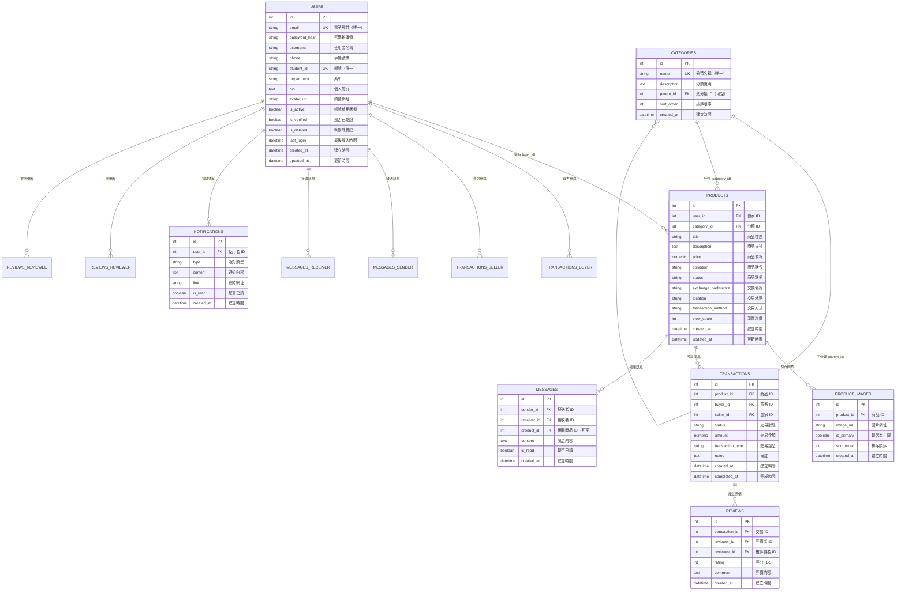

# StudentTrade 資料庫設計

## 一、資料庫概述

### 1.1 資料庫基本資訊

**資料庫管理系統**: PostgreSQL 16
**字元編碼**: UTF-8
**時區**: Asia/Taipei (UTC+8)
**資料庫名稱**: `studenttrade`

### 1.2 設計原則

- 符合第三正規化（3NF）
- 使用有意義的命名（英文小寫 + 底線）
- 所有資料表包含 `created_at` 和 `updated_at` 時間戳記
- 使用外鍵約束確保資料完整性
- 為常用查詢欄位建立索引

---

## 二、實體關係圖 (ERD)

### 2.1 完整 ERD



### 2.2 關聯說明

| 關聯 | 類型 | 說明 |
|------|------|------|
| USERS → PRODUCTS | 一對多 | 一位使用者可擁有多個商品 |
| CATEGORIES → PRODUCTS | 一對多 | 一個分類包含多個商品 |
| CATEGORIES → CATEGORIES | 一對多 | 分類可有子分類（樹狀結構） |
| PRODUCTS → PRODUCT_IMAGES | 一對多 | 一個商品可有多張圖片 |
| PRODUCTS → TRANSACTIONS | 一對多 | 一個商品可有多筆交易記錄 |
| USERS → TRANSACTIONS | 一對多 | 使用者可作為買家或賣家參與多筆交易 |
| TRANSACTIONS → REVIEWS | 一對多 | 一筆交易可產生多個評價（買賣雙方互評） |
| USERS → MESSAGES | 一對多 | 使用者可發送/接收多則訊息 |
| PRODUCTS → MESSAGES | 一對多 | 商品可關聯多則訊息 |
| USERS → NOTIFICATIONS | 一對多 | 使用者可接收多則通知 |

---

## 三、資料表詳細設計

### 3.1 USERS（使用者表）

**用途**: 儲存所有註冊使用者的基本資料

| 欄位名稱 | 資料型態 | 約束 | 說明 |
|---------|---------|------|------|
| `id` | INTEGER | PRIMARY KEY, AUTO_INCREMENT | 使用者 ID |
| `email` | VARCHAR(120) | UNIQUE, NOT NULL | 電子郵件 |
| `password_hash` | VARCHAR(255) | NOT NULL | 密碼雜湊值（bcrypt） |
| `username` | VARCHAR(80) | NOT NULL | 使用者名稱 |
| `phone` | VARCHAR(20) | NULL | 手機號碼 |
| `student_id` | VARCHAR(20) | UNIQUE, NULL | 學號 |
| `department` | VARCHAR(120) | NULL | 系所 |
| `bio` | TEXT | NULL | 個人簡介 |
| `avatar_url` | VARCHAR(255) | NULL | 頭像圖片路徑 |
| `is_active` | BOOLEAN | DEFAULT TRUE | 帳號啟用狀態 |
| `is_verified` | BOOLEAN | DEFAULT FALSE | 是否已驗證（郵件驗證等） |
| `is_deleted` | BOOLEAN | DEFAULT FALSE | 軟刪除標記 |
| `last_login` | TIMESTAMP | NULL | 最後登入時間 |
| `created_at` | TIMESTAMP | DEFAULT CURRENT_TIMESTAMP | 建立時間 |
| `updated_at` | TIMESTAMP | DEFAULT CURRENT_TIMESTAMP, ON UPDATE | 更新時間 |

**SQL 建表語句**:
```sql
CREATE TABLE users (
    id SERIAL PRIMARY KEY,
    email VARCHAR(120) UNIQUE NOT NULL,
    password_hash VARCHAR(255) NOT NULL,
    username VARCHAR(80) NOT NULL,
    phone VARCHAR(20),
    student_id VARCHAR(20) UNIQUE,
    department VARCHAR(120),
    bio TEXT,
    avatar_url VARCHAR(255),
    is_active BOOLEAN NOT NULL DEFAULT TRUE,
    is_verified BOOLEAN NOT NULL DEFAULT FALSE,
    is_deleted BOOLEAN NOT NULL DEFAULT FALSE,
    last_login TIMESTAMP,
    created_at TIMESTAMP NOT NULL DEFAULT CURRENT_TIMESTAMP,
    updated_at TIMESTAMP NOT NULL DEFAULT CURRENT_TIMESTAMP
);

-- 索引
CREATE INDEX idx_users_email ON users(email);
CREATE INDEX idx_users_student_id ON users(student_id);

-- 觸發器（自動更新 updated_at）
CREATE OR REPLACE FUNCTION update_updated_at_column()
RETURNS TRIGGER AS $$
BEGIN
    NEW.updated_at = CURRENT_TIMESTAMP;
    RETURN NEW;
END;
$$ LANGUAGE plpgsql;

CREATE TRIGGER update_users_updated_at BEFORE UPDATE ON users
FOR EACH ROW EXECUTE FUNCTION update_updated_at_column();
```

---

### 3.2 CATEGORIES（商品分類表）

**用途**: 儲存商品分類資訊，支援多層級分類

| 欄位名稱 | 資料型態 | 約束 | 說明 |
|---------|---------|------|------|
| `id` | INTEGER | PRIMARY KEY, AUTO_INCREMENT | 分類 ID |
| `name` | VARCHAR(50) | UNIQUE, NOT NULL | 分類名稱 |
| `description` | TEXT | NULL | 分類說明 |
| `parent_id` | INTEGER | FK(categories.id), NULL | 父分類 ID（NULL 表示頂層分類） |
| `sort_order` | INTEGER | DEFAULT 0 | 排序順序 |
| `created_at` | TIMESTAMP | DEFAULT CURRENT_TIMESTAMP | 建立時間 |

**SQL 建表語句**:
```sql
CREATE TABLE categories (
    id SERIAL PRIMARY KEY,
    name VARCHAR(50) UNIQUE NOT NULL,
    description TEXT,
    parent_id INTEGER REFERENCES categories(id) ON DELETE SET NULL,
    sort_order INTEGER DEFAULT 0,
    created_at TIMESTAMP DEFAULT CURRENT_TIMESTAMP
);

CREATE INDEX idx_categories_parent ON categories(parent_id);
```

**預設分類資料**:
```sql
INSERT INTO categories (name, description, parent_id, sort_order) VALUES
('書籍', '教科書、參考書、小說等', NULL, 1),
('文具', '筆記本、筆、文具用品', NULL, 2),
('電子產品', '3C 產品、電腦周邊', NULL, 3),
('生活用品', '日常生活用品', NULL, 4),
('運動用品', '運動器材、服裝', NULL, 5),
('其他', '其他類別商品', NULL, 99);
```

---

### 3.3 PRODUCTS（商品表）

**用途**: 儲存二手商品資訊

| 欄位名稱 | 資料型態 | 約束 | 說明 |
|---------|---------|------|------|
| `id` | INTEGER | PRIMARY KEY, AUTO_INCREMENT | 商品 ID |
| `user_id` | INTEGER | FK(users.id), NOT NULL | 賣家 ID |
| `category_id` | INTEGER | FK(categories.id), NOT NULL | 分類 ID |
| `title` | VARCHAR(200) | NOT NULL | 商品標題 |
| `description` | TEXT | NOT NULL | 商品描述 |
| `price` | DECIMAL(10, 2) | NOT NULL | 商品價格 |
| `condition` | VARCHAR(20) | NOT NULL | 商品狀況（全新/近全新/良好/普通） |
| `status` | VARCHAR(20) | DEFAULT 'active' | 商品狀態（active/sold/deleted） |
| `exchange_preference` | VARCHAR(200) | NULL | 交換偏好說明 |
| `location` | VARCHAR(200) | NULL | 交易地點 |
| `transaction_method` | VARCHAR(200) | NULL | 交易方式（面交/郵寄/其他） |
| `view_count` | INTEGER | DEFAULT 0 | 瀏覽次數 |
| `created_at` | TIMESTAMP | DEFAULT CURRENT_TIMESTAMP | 建立時間 |
| `updated_at` | TIMESTAMP | DEFAULT CURRENT_TIMESTAMP, ON UPDATE | 更新時間 |

**SQL 建表語句**:
```sql
CREATE TABLE products (
    id SERIAL PRIMARY KEY,
    user_id INTEGER NOT NULL REFERENCES users(id) ON DELETE CASCADE,
    category_id INTEGER NOT NULL REFERENCES categories(id) ON DELETE RESTRICT,
    title VARCHAR(200) NOT NULL,
    description TEXT NOT NULL,
    price NUMERIC(10, 2) NOT NULL CHECK (price >= 0),
    condition VARCHAR(20) NOT NULL,
    status VARCHAR(20) NOT NULL DEFAULT 'active',
    exchange_preference VARCHAR(200),
    location VARCHAR(200),
    transaction_method VARCHAR(200),
    view_count INTEGER NOT NULL DEFAULT 0,
    created_at TIMESTAMP NOT NULL DEFAULT CURRENT_TIMESTAMP,
    updated_at TIMESTAMP NOT NULL DEFAULT CURRENT_TIMESTAMP
);

-- 索引
CREATE INDEX idx_products_user ON products(user_id);
CREATE INDEX idx_products_category ON products(category_id);
CREATE INDEX idx_products_status ON products(status);
CREATE INDEX idx_products_price ON products(price);
CREATE INDEX idx_products_created ON products(created_at DESC);

-- 複合索引（常用查詢組合）
CREATE INDEX idx_products_status_category ON products(status, category_id);
CREATE INDEX idx_products_status_price ON products(status, price);

-- 全文搜尋索引
CREATE INDEX idx_products_search ON products
USING GIN(to_tsvector('english', title || ' ' || description));

-- 觸發器
CREATE TRIGGER update_products_updated_at BEFORE UPDATE ON products
FOR EACH ROW EXECUTE FUNCTION update_updated_at_column();

-- 約束：商品狀況必須為指定值
ALTER TABLE products ADD CONSTRAINT check_product_condition
CHECK (condition IN ('全新', '近全新', '良好', '普通'));

ALTER TABLE products ADD CONSTRAINT check_product_status
CHECK (status IN ('active', 'sold', 'deleted'));
```

---

### 3.4 PRODUCT_IMAGES（商品圖片表）

**用途**: 儲存商品的圖片資訊

| 欄位名稱 | 資料型態 | 約束 | 說明 |
|---------|---------|------|------|
| `id` | INTEGER | PRIMARY KEY, AUTO_INCREMENT | 圖片 ID |
| `product_id` | INTEGER | FK(products.id), NOT NULL | 商品 ID |
| `image_url` | VARCHAR(255) | NOT NULL | 圖片檔案路徑 |
| `is_primary` | BOOLEAN | DEFAULT FALSE | 是否為主圖 |
| `sort_order` | INTEGER | DEFAULT 0 | 排序順序 |
| `created_at` | TIMESTAMP | DEFAULT CURRENT_TIMESTAMP | 建立時間 |

**SQL 建表語句**:
```sql
CREATE TABLE product_images (
    id SERIAL PRIMARY KEY,
    product_id INTEGER NOT NULL REFERENCES products(id) ON DELETE CASCADE,
    image_url VARCHAR(255) NOT NULL,
    is_primary BOOLEAN DEFAULT FALSE,
    sort_order INTEGER DEFAULT 0,
    created_at TIMESTAMP DEFAULT CURRENT_TIMESTAMP
);

CREATE INDEX idx_product_images_product ON product_images(product_id);
CREATE INDEX idx_product_images_primary ON product_images(product_id, is_primary);
```

---

### 3.5 TRANSACTIONS（交易表）

**用途**: 儲存交易記錄

| 欄位名稱 | 資料型態 | 約束 | 說明 |
|---------|---------|------|------|
| `id` | INTEGER | PRIMARY KEY, AUTO_INCREMENT | 交易 ID |
| `product_id` | INTEGER | FK(products.id), NOT NULL | 商品 ID |
| `buyer_id` | INTEGER | FK(users.id), NOT NULL | 買家 ID |
| `seller_id` | INTEGER | FK(users.id), NOT NULL | 賣家 ID |
| `status` | VARCHAR(20) | DEFAULT 'pending' | 交易狀態 |
| `amount` | DECIMAL(10, 2) | NOT NULL | 交易金額 |
| `transaction_type` | VARCHAR(20) | NOT NULL | 交易類型（sale/exchange/free） |
| `notes` | TEXT | NULL | 備註 |
| `created_at` | TIMESTAMP | DEFAULT CURRENT_TIMESTAMP | 建立時間 |
| `completed_at` | TIMESTAMP | NULL | 完成時間 |

**交易狀態說明**:
- `pending` - 等待賣家回應
- `accepted` - 賣家已接受
- `in_progress` - 交易進行中
- `rejected` - 賣家已拒絕
- `completed` - 交易完成
- `cancelled` - 交易取消
- `disputed` - 爭議中

**交易狀態流程圖**:
```
pending (待賣家回應)
  ├─→ accepted (賣家接受)
  │     └─→ in_progress (交易進行中)
  │           ├─→ completed (已完成)
  │           └─→ disputed (爭議中)
  ├─→ rejected (已拒絕) [終態]
  └─→ cancelled (已取消) [終態]
```

**交易類型說明**:
- `sale` - 買賣交易（有金額）
- `exchange` - 物品交換（可能無金額或象徵性金額）
- `free` - 免費贈送（金額為0）

**SQL 建表語句**:
```sql
CREATE TABLE transactions (
    id SERIAL PRIMARY KEY,
    product_id INTEGER NOT NULL REFERENCES products(id) ON DELETE RESTRICT,
    buyer_id INTEGER NOT NULL REFERENCES users(id) ON DELETE RESTRICT,
    seller_id INTEGER NOT NULL REFERENCES users(id) ON DELETE RESTRICT,
    status VARCHAR(20) NOT NULL DEFAULT 'pending',
    amount NUMERIC(10, 2) NOT NULL CHECK (amount >= 0),
    transaction_type VARCHAR(20) NOT NULL,
    notes TEXT,
    created_at TIMESTAMP NOT NULL DEFAULT CURRENT_TIMESTAMP,
    completed_at TIMESTAMP,
    CONSTRAINT check_buyer_not_seller CHECK (buyer_id != seller_id),
    CONSTRAINT chk_transaction_status CHECK (status IN ('pending', 'accepted', 'in_progress', 'completed', 'cancelled', 'rejected', 'disputed')),
    CONSTRAINT chk_transaction_type CHECK (transaction_type IN ('sale', 'exchange', 'free'))
);

CREATE INDEX IF NOT EXISTS idx_transactions_product ON transactions(product_id);
CREATE INDEX IF NOT EXISTS idx_transactions_buyer ON transactions(buyer_id);
CREATE INDEX IF NOT EXISTS idx_transactions_seller ON transactions(seller_id);
CREATE INDEX IF NOT EXISTS idx_transactions_status ON transactions(status);
```

---

### 3.6 MESSAGES（訊息表）

**用途**: 儲存使用者間的私訊

| 欄位名稱 | 資料型態 | 約束 | 說明 |
|---------|---------|------|------|
| `id` | INTEGER | PRIMARY KEY, AUTO_INCREMENT | 訊息 ID |
| `sender_id` | INTEGER | FK(users.id), NOT NULL | 發送者 ID |
| `receiver_id` | INTEGER | FK(users.id), NOT NULL | 接收者 ID |
| `product_id` | INTEGER | FK(products.id), NULL | 相關商品 ID |
| `content` | TEXT | NOT NULL | 訊息內容 |
| `is_read` | BOOLEAN | DEFAULT FALSE | 是否已讀 |
| `created_at` | TIMESTAMP | DEFAULT CURRENT_TIMESTAMP | 建立時間 |

**SQL 建表語句**:
```sql
CREATE TABLE messages (
    id SERIAL PRIMARY KEY,
    sender_id INTEGER NOT NULL REFERENCES users(id) ON DELETE CASCADE,
    receiver_id INTEGER NOT NULL REFERENCES users(id) ON DELETE CASCADE,
    product_id INTEGER REFERENCES products(id) ON DELETE SET NULL,
    content TEXT NOT NULL,
    is_read BOOLEAN DEFAULT FALSE,
    created_at TIMESTAMP DEFAULT CURRENT_TIMESTAMP,
    CONSTRAINT check_sender_not_receiver CHECK (sender_id != receiver_id)
);

CREATE INDEX idx_messages_sender ON messages(sender_id);
CREATE INDEX idx_messages_receiver ON messages(receiver_id);
CREATE INDEX idx_messages_product ON messages(product_id);
CREATE INDEX idx_messages_conversation ON messages(sender_id, receiver_id, created_at DESC);
CREATE INDEX idx_messages_unread ON messages(receiver_id, is_read) WHERE is_read = FALSE;
```

---

### 3.7 NOTIFICATIONS（通知表）

**用途**: 儲存系統通知

| 欄位名稱 | 資料型態 | 約束 | 說明 |
|---------|---------|------|------|
| `id` | INTEGER | PRIMARY KEY, AUTO_INCREMENT | 通知 ID |
| `user_id` | INTEGER | FK(users.id), NOT NULL | 使用者 ID |
| `type` | VARCHAR(50) | NOT NULL | 通知類型 |
| `content` | TEXT | NOT NULL | 通知內容 |
| `link` | VARCHAR(255) | NULL | 相關連結 |
| `is_read` | BOOLEAN | DEFAULT FALSE | 是否已讀 |
| `created_at` | TIMESTAMP | DEFAULT CURRENT_TIMESTAMP | 建立時間 |

**通知類型**:
- `new_message` - 新訊息
- `transaction_request` - 交易請求
- `transaction_accepted` - 交易被接受
- `transaction_completed` - 交易完成
- `new_review` - 新評價
- `system_announcement` - 系統公告

**SQL 建表語句**:
```sql
CREATE TABLE notifications (
    id SERIAL PRIMARY KEY,
    user_id INTEGER NOT NULL REFERENCES users(id) ON DELETE CASCADE,
    type VARCHAR(50) NOT NULL,
    content TEXT NOT NULL,
    link VARCHAR(255),
    is_read BOOLEAN DEFAULT FALSE,
    created_at TIMESTAMP DEFAULT CURRENT_TIMESTAMP
);

CREATE INDEX idx_notifications_user ON notifications(user_id);
CREATE INDEX idx_notifications_unread ON notifications(user_id, is_read) WHERE is_read = FALSE;
CREATE INDEX idx_notifications_created ON notifications(created_at DESC);
```

---

### 3.8 REVIEWS（評價表）

**用途**: 儲存交易完成後的評價

| 欄位名稱 | 資料型態 | 約束 | 說明 |
|---------|---------|------|------|
| `id` | INTEGER | PRIMARY KEY, AUTO_INCREMENT | 評價 ID |
| `transaction_id` | INTEGER | FK(transactions.id), NOT NULL | 交易 ID |
| `reviewer_id` | INTEGER | FK(users.id), NOT NULL | 評價者 ID |
| `reviewee_id` | INTEGER | FK(users.id), NOT NULL | 被評價者 ID |
| `rating` | INTEGER | NOT NULL | 評分（1-5 星） |
| `comment` | TEXT | NULL | 評價內容 |
| `created_at` | TIMESTAMP | DEFAULT CURRENT_TIMESTAMP | 建立時間 |

**SQL 建表語句**:
```sql
CREATE TABLE reviews (
    id SERIAL PRIMARY KEY,
    transaction_id INTEGER NOT NULL REFERENCES transactions(id) ON DELETE RESTRICT,
    reviewer_id INTEGER NOT NULL REFERENCES users(id) ON DELETE CASCADE,
    reviewee_id INTEGER NOT NULL REFERENCES users(id) ON DELETE CASCADE,
    rating INTEGER NOT NULL CHECK (rating >= 1 AND rating <= 5),
    comment TEXT,
    created_at TIMESTAMP DEFAULT CURRENT_TIMESTAMP,
    CONSTRAINT check_reviewer_not_reviewee CHECK (reviewer_id != reviewee_id),
    CONSTRAINT unique_transaction_reviewer UNIQUE (transaction_id, reviewer_id)
);

CREATE INDEX idx_reviews_transaction ON reviews(transaction_id);
CREATE INDEX idx_reviews_reviewee ON reviews(reviewee_id);
CREATE INDEX idx_reviews_rating ON reviews(reviewee_id, rating);
```

---

## 四、資料庫遷移腳本

### 4.1 初始化資料庫

**建立資料庫**:
```sql
-- 以 postgres 使用者身分執行
CREATE DATABASE studenttrade
    WITH
    ENCODING = 'UTF8'
    LC_COLLATE = 'zh_TW.UTF-8'
    LC_CTYPE = 'zh_TW.UTF-8'
    TEMPLATE = template0;

-- 建立應用程式使用者（可選）
CREATE USER studenttrade_user WITH PASSWORD 'your_password';
GRANT ALL PRIVILEGES ON DATABASE studenttrade TO studenttrade_user;

-- 連接到資料庫
\c studenttrade;

-- 授予 Schema 權限
GRANT ALL ON SCHEMA public TO studenttrade_user;
```

### 4.2 Flask-Migrate 使用

```bash
# 初始化遷移
flask db init

# 建立遷移檔案
flask db migrate -m "Initial migration"

# 執行遷移
flask db upgrade

# 回滾遷移（如需要）
flask db downgrade
```

---

## 五、常用查詢範例

### 5.1 商品搜尋查詢

```sql
-- 全文搜尋商品
SELECT p.*, u.username as seller_name, c.name as category_name
FROM products p
JOIN users u ON p.user_id = u.id
JOIN categories c ON p.category_id = c.id
WHERE p.status = 'active'
  AND to_tsvector('english', p.title || ' ' || p.description) @@ to_tsquery('電腦')
ORDER BY p.created_at DESC
LIMIT 20;

-- 價格範圍篩選
SELECT * FROM products
WHERE status = 'active'
  AND price BETWEEN 100 AND 1000
  AND category_id = 3
ORDER BY price ASC;
```

### 5.2 使用者評價統計

```sql
-- 計算使用者平均評分
SELECT
    u.id,
    u.username,
    COUNT(r.id) as review_count,
    AVG(r.rating) as avg_rating
FROM users u
LEFT JOIN reviews r ON u.id = r.reviewee_id
GROUP BY u.id, u.username
HAVING COUNT(r.id) > 0
ORDER BY avg_rating DESC;
```

### 5.3 熱門商品查詢

```sql
-- 最多瀏覽的商品
SELECT p.*, u.username, c.name as category
FROM products p
JOIN users u ON p.user_id = u.id
JOIN categories c ON p.category_id = c.id
WHERE p.status = 'active'
ORDER BY p.view_count DESC
LIMIT 10;
```

---

## 六、備份與恢復策略

### 6.1 定期備份

```bash
# 完整備份
pg_dump -U studenttrade_user -h localhost studenttrade > backup_$(date +%Y%m%d).sql

# 僅備份資料（不含結構）
pg_dump -U studenttrade_user -h localhost --data-only studenttrade > data_backup.sql

# 僅備份結構（不含資料）
pg_dump -U studenttrade_user -h localhost --schema-only studenttrade > schema_backup.sql
```

### 6.2 恢復資料庫

```bash
# 從備份恢復
psql -U studenttrade_user -h localhost studenttrade < backup_20241129.sql
```

---

## 七、效能優化建議

### 7.1 索引策略總結

| 資料表 | 索引欄位 | 用途 |
|--------|---------|------|
| users | email, student_id | 登入查詢、學號驗證 |
| products | status, category_id, price | 商品列表篩選 |
| products | 全文搜尋索引 | 關鍵字搜尋 |
| transactions | buyer_id, seller_id, status | 交易記錄查詢 |
| messages | sender_id, receiver_id | 對話查詢 |
| notifications | user_id, is_read | 未讀通知查詢 |

### 7.2 查詢優化技巧

1. **使用 EXPLAIN ANALYZE** 分析查詢效能
2. **避免 SELECT *** - 只選擇需要的欄位
3. **使用分頁** - LIMIT 與 OFFSET
4. **適當使用 JOIN** - 避免 N+1 查詢問題
5. **定期執行 VACUUM** - 清理死元組

---

## 八、總結

### 8.1 資料表總覽

| # | 資料表名稱 | 用途 | 記錄數預估 |
|---|-----------|------|-----------|
| 1 | users | 使用者 | 100-1000 |
| 2 | categories | 商品分類 | 10-50 |
| 3 | products | 商品 | 500-5000 |
| 4 | product_images | 商品圖片 | 1000-10000 |
| 5 | transactions | 交易記錄 | 200-2000 |
| 6 | messages | 私訊 | 1000-10000 |
| 7 | notifications | 通知 | 2000-20000 |
| 8 | reviews | 評價 | 100-1000 |

### 8.2 關鍵設計決策

✅ **PostgreSQL 16** - 強大的關聯式資料庫
✅ **第三正規化** - 減少資料冗餘
✅ **外鍵約束** - 確保資料完整性
✅ **索引優化** - 提升查詢效能
✅ **全文搜尋** - PostgreSQL 內建功能

### 8.3 下一步

請繼續閱讀：
- [04-api-design.md](./04-api-design.md) - API 設計
- [07-development-guide.md](./07-development-guide.md) - 開發指南

---

## 九、資料庫更新歷史

### 9.1 最新更新（2025-12-29）

#### USERS 表更新
新增欄位：
- `department` (VARCHAR(120)) - 系所資訊
- `bio` (TEXT) - 個人簡介
- `is_verified` (BOOLEAN) - 郵件驗證狀態
- `is_deleted` (BOOLEAN) - 軟刪除標記
- `last_login` (TIMESTAMP) - 最後登入時間

#### PRODUCTS 表更新
新增欄位：
- `location` (VARCHAR(200)) - 交易地點
- `transaction_method` (VARCHAR(200)) - 交易方式（面交/郵寄/其他）

#### TRANSACTIONS 表更新
新增狀態：
- `in_progress` - 交易進行中狀態（在 accepted 和 completed 之間）
- `disputed` - 爭議中狀態（處理交易糾紛）

交易類型更新：
- 從 `purchase` 改為 `sale`（語義更清晰）
- 新增 `free` 類型（免費贈送）

### 9.2 功能改進

**交易流程優化**：
- 新增中間狀態 `in_progress`，使交易流程更完整
- 增加 `disputed` 狀態，支援糾紛處理
- 完整的狀態轉換機制（見 [app/models/transaction.py](../app/models/transaction.py)）

**使用者體驗增強**：
- 支援個人簡介和系所資訊
- 郵件驗證機制
- 軟刪除功能（保留歷史資料）

**商品資訊完善**：
- 交易地點資訊（方便面交）
- 交易方式說明（提高交易透明度）

### 9.3 資料遷移注意事項

如果從舊版本升級，請注意：

1. **新增 NOT NULL 欄位已設定預設值**，無需手動處理
2. **交易類型遷移**：舊的 `purchase` 需要更新為 `sale`
   ```sql
   UPDATE transactions SET transaction_type = 'sale' WHERE transaction_type = 'purchase';
   ```
3. **新增狀態約束**：確保現有交易狀態符合新的約束條件
4. **建議執行**：
   ```bash
   # 使用 Flask-Migrate 進行資料庫遷移
   flask db migrate -m "Add new fields to users and products tables"
   flask db upgrade
   ```

### 9.4 資料庫版本

| 版本 | 日期 | 主要變更 |
|------|------|---------|
| v1.0 | 2024-11 | 初始版本（8張表基礎架構） |
| v1.1 | 2024-12 | 交易功能完善（狀態流程優化） |
| **v1.2** | **2025-12-29** | **使用者資料擴充、商品資訊完善、交易流程強化** |
