# StudentTrade 資料庫 ERD - 簡報版

## 完整實體關係圖（適合簡報使用）

### 方案一：關係導向圖（推薦用於簡報）

```mermaid
erDiagram
    %% 核心實體
    USERS ||--o{ PRODUCTS : "上架"
    USERS ||--o{ TRANSACTIONS_AS_BUYER : "作為買家"
    USERS ||--o{ TRANSACTIONS_AS_SELLER : "作為賣家"
    USERS ||--o{ MESSAGES_SENDER : "發送"
    USERS ||--o{ MESSAGES_RECEIVER : "接收"
    USERS ||--o{ NOTIFICATIONS : "接收通知"
    USERS ||--o{ REVIEWS_REVIEWER : "給予評價"
    USERS ||--o{ REVIEWS_REVIEWEE : "收到評價"

    %% 分類關係
    CATEGORIES ||--o{ CATEGORIES : "子分類"
    CATEGORIES ||--o{ PRODUCTS : "分類"

    %% 商品關係
    PRODUCTS ||--o{ PRODUCT_IMAGES : "包含圖片"
    PRODUCTS ||--o{ TRANSACTIONS : "產生交易"
    PRODUCTS ||--o{ MESSAGES : "相關訊息"

    %% 交易關係
    TRANSACTIONS ||--o{ REVIEWS : "產生評價"

    %% 使用者表
    USERS {
        int id PK "主鍵"
        string email UK "信箱（唯一）"
        string username "使用者名稱"
        string student_id UK "學號（唯一）"
        string department "系所"
        boolean is_verified "是否驗證"
        datetime created_at "建立時間"
    }

    %% 分類表
    CATEGORIES {
        int id PK "主鍵"
        string name UK "分類名稱（唯一）"
        int parent_id FK "父分類ID（自關聯）"
        int sort_order "排序"
    }

    %% 商品表
    PRODUCTS {
        int id PK "主鍵"
        int user_id FK "賣家ID"
        int category_id FK "分類ID"
        string title "商品標題"
        numeric price "價格"
        string status "狀態"
        string location "交易地點"
        int view_count "瀏覽數"
        datetime created_at "建立時間"
    }

    %% 商品圖片表
    PRODUCT_IMAGES {
        int id PK "主鍵"
        int product_id FK "商品ID"
        string image_url "圖片URL"
        boolean is_primary "是否主圖"
    }

    %% 交易表
    TRANSACTIONS {
        int id PK "主鍵"
        int product_id FK "商品ID"
        int buyer_id FK "買家ID"
        int seller_id FK "賣家ID"
        string status "交易狀態"
        string transaction_type "交易類型"
        numeric amount "金額"
        datetime created_at "建立時間"
    }

    %% 訊息表
    MESSAGES {
        int id PK "主鍵"
        int sender_id FK "發送者ID"
        int receiver_id FK "接收者ID"
        int product_id FK "商品ID（可空）"
        text content "訊息內容"
        boolean is_read "已讀"
        datetime created_at "建立時間"
    }

    %% 通知表
    NOTIFICATIONS {
        int id PK "主鍵"
        int user_id FK "使用者ID"
        string type "通知類型"
        text content "內容"
        boolean is_read "已讀"
        datetime created_at "建立時間"
    }

    %% 評價表
    REVIEWS {
        int id PK "主鍵"
        int transaction_id FK "交易ID"
        int reviewer_id FK "評價者ID"
        int reviewee_id FK "被評價者ID"
        int rating "評分1-5"
        text comment "評論"
        datetime created_at "建立時間"
    }
```

---

### 方案二：簡化版（極簡，適合快速說明）

---

### 方案三：分組模塊圖（按功能分組）

---

## 關聯關係說明表

| 主表 (One) | 關聯類型 | 從表 (Many) | 外鍵欄位 | 說明 |
|-----------|---------|------------|---------|------|
| **USERS** | 1:N | PRODUCTS | user_id | 一個使用者可上架多個商品 |
| **USERS** | 1:N | TRANSACTIONS (買家) | buyer_id | 一個使用者可以是多筆交易的買家 |
| **USERS** | 1:N | TRANSACTIONS (賣家) | seller_id | 一個使用者可以是多筆交易的賣家 |
| **USERS** | 1:N | MESSAGES (發送) | sender_id | 一個使用者可發送多則訊息 |
| **USERS** | 1:N | MESSAGES (接收) | receiver_id | 一個使用者可接收多則訊息 |
| **USERS** | 1:N | NOTIFICATIONS | user_id | 一個使用者可接收多則通知 |
| **USERS** | 1:N | REVIEWS (評價者) | reviewer_id | 一個使用者可給出多個評價 |
| **USERS** | 1:N | REVIEWS (被評價) | reviewee_id | 一個使用者可收到多個評價 |
| **CATEGORIES** | 1:N | CATEGORIES | parent_id | 一個分類可包含多個子分類（樹狀結構） |
| **CATEGORIES** | 1:N | PRODUCTS | category_id | 一個分類可包含多個商品 |
| **PRODUCTS** | 1:N | PRODUCT_IMAGES | product_id | 一個商品可有多張圖片 |
| **PRODUCTS** | 1:N | TRANSACTIONS | product_id | 一個商品可有多筆交易記錄 |
| **PRODUCTS** | 1:N | MESSAGES | product_id | 一個商品可有多則相關訊息 |
| **TRANSACTIONS** | 1:N | REVIEWS | transaction_id | 一筆交易可產生多個評價（買賣雙方互評） |

---

## 核心關聯圖（流程導向）

---

## 交易狀態流程圖

---

## 使用建議

### 簡報場景建議

1. **快速概覽（5分鐘內）**
   - 使用「方案二：簡化版」
   - 搭配「關聯關係說明表」

2. **詳細說明（10-15分鐘）**
   - 使用「方案一：關係導向圖」
   - 搭配「核心關聯圖（流程導向）」

3. **功能模組說明**
   - 使用「方案三：分組模塊圖」
   - 按模組逐一解釋

4. **交易流程重點**
   - 使用「交易狀態流程圖」
   - 展示完整的交易生命週期

---

## 8 張資料表總覽

| # | 資料表名稱 | 中文名稱 | 主要用途 | 關聯數量 |
|---|-----------|---------|---------|---------|
| 1 | **USERS** | 使用者表 | 儲存使用者資料 | 8 個關聯 |
| 2 | **CATEGORIES** | 分類表 | 商品分類（支援樹狀結構） | 2 個關聯 |
| 3 | **PRODUCTS** | 商品表 | 二手商品資料 | 3 個關聯 |
| 4 | **PRODUCT_IMAGES** | 商品圖片表 | 商品圖片管理 | 1 個關聯 |
| 5 | **TRANSACTIONS** | 交易表 | 交易記錄與狀態 | 1 個關聯 |
| 6 | **MESSAGES** | 訊息表 | 使用者私訊系統 | 0 個關聯 |
| 7 | **NOTIFICATIONS** | 通知表 | 系統通知推送 | 0 個關聯 |
| 8 | **REVIEWS** | 評價表 | 交易後評價 | 0 個關聯 |

**總計**: 8 張資料表，15 個一對多關聯關係

---

**製作日期**: 2025-12-29
**用途**: 簡報與教學使用
**完整文檔**: [03-database-design.md](./03-database-design.md)
