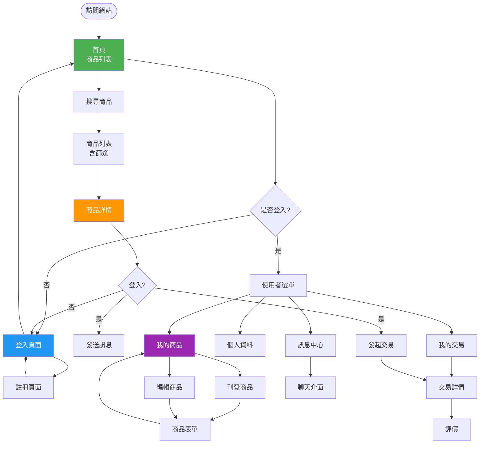
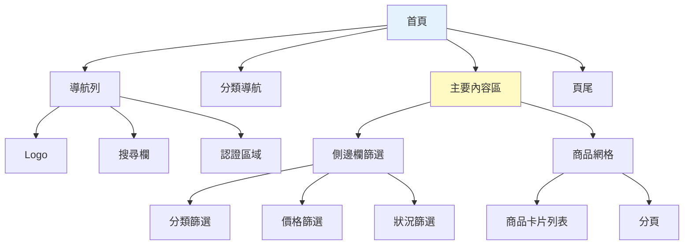

# StudentTrade 前端設計文檔

## 一、前端技術概述

### 1.1 技術棧

| 技術 | 版本 | 用途 |
|------|------|------|
| **Jinja2** | 3.x | 模板引擎（Flask 內建） |
| **Tailwind CSS** | 4.1 | CSS 框架 |
| **JavaScript** | ES6+ | 前端互動邏輯 |
| **HTML5** | - | 頁面結構 |

### 1.2 設計原則

- **響應式設計（RWD）** - 支援桌面、平板、手機
- **行動優先（Mobile First）** - 從小螢幕開始設計
- **組件化設計** - 可重用的 UI 組件
- **語義化 HTML** - 使用有意義的 HTML 標籤
- **無障礙設計（A11y）** - 支援鍵盤導航和螢幕閱讀器

---

## 二、頁面結構設計

### 2.1 頁面流程圖



---

## 三、主要頁面設計

### 3.1 首頁（index.html）

**路徑**: `/` 或 `/products`
**模板**: `templates/products/index.html`

**頁面結構**:
```
┌─────────────────────────────────────┐
│         導航列 (Navbar)              │
│  Logo | 搜尋欄 | 登入/使用者選單     │
├─────────────────────────────────────┤
│         分類快速導航                 │
│  [書籍] [文具] [電子] [生活] ...    │
├─────────────────────────────────────┤
│ 側邊欄篩選器  │   商品網格列表      │
│               │                     │
│ 分類          │  ┌────┬────┬────┐  │
│ □ 書籍        │  │商品│商品│商品│  │
│ □ 文具        │  │卡片│卡片│卡片│  │
│               │  └────┴────┴────┘  │
│ 價格範圍      │  ┌────┬────┬────┐  │
│ [    ] - [   ]│  │商品│商品│商品│  │
│               │  │卡片│卡片│卡片│  │
│ 商品狀況      │  └────┴────┴────┘  │
│ □ 全新        │                     │
│ □ 近全新      │   分頁導航          │
│ □ 良好        │  ← 1 2 3 4 5 →     │
└───────────────┴─────────────────────┘
│              頁尾 (Footer)          │
└─────────────────────────────────────┘
```

**Wireframe**:


**關鍵功能**:
- 搜尋欄（即時搜尋提示）
- 分類篩選
- 價格範圍篩選
- 商品狀況篩選
- 排序選項（最新、價格、熱門）
- 分頁導航

---

### 3.2 商品詳情頁（product_detail.html）

**路徑**: `/products/<id>`
**模板**: `templates/products/detail.html`

**頁面結構**:
```
┌─────────────────────────────────────────────────┐
│                  導航列                          │
├────────────────────┬────────────────────────────┤
│                    │                            │
│   商品圖片輪播      │   商品資訊                 │
│                    │                            │
│  ┌──────────────┐  │  商品標題                  │
│  │              │  │  NT$ 25,000               │
│  │   主圖片      │  │                           │
│  │              │  │  狀況：良好                │
│  └──────────────┘  │  分類：電子產品            │
│  [縮圖] [縮圖]      │  上架時間：2024-11-29     │
│                    │                            │
│                    │  商品描述                  │
│                    │  這是商品的詳細描述...     │
│                    │                            │
│                    │  [聯繫賣家] [發起交易]     │
├────────────────────┴────────────────────────────┤
│                賣家資訊                          │
│  頭像 | 名稱 | 評分：⭐⭐⭐⭐⭐ (4.8)        │
├─────────────────────────────────────────────────┤
│                相似商品推薦                       │
│  [商品1] [商品2] [商品3] [商品4]                │
└─────────────────────────────────────────────────┘
```

**關鍵功能**:
- 圖片輪播（支援放大查看）
- 商品完整資訊
- 賣家資訊卡片
- 聯繫賣家按鈕（需登入）
- 發起交易按鈕（需登入）
- 相似商品推薦
- 瀏覽次數統計

---

### 3.3 商品表單頁（product_form.html）

**路徑**: `/products/new` 或 `/products/<id>/edit`
**模板**: `templates/products/form.html`

**頁面結構**:
```
┌─────────────────────────────────────┐
│             導航列                   │
├─────────────────────────────────────┤
│          刊登商品 / 編輯商品         │
│                                     │
│  商品標題 *                         │
│  [                              ]  │
│                                     │
│  商品分類 *                         │
│  [請選擇分類 ▼]                     │
│                                     │
│  商品描述 *                         │
│  [                              ]  │
│  [                              ]  │
│  [                              ]  │
│                                     │
│  商品價格 *                         │
│  NT$ [                          ]  │
│                                     │
│  商品狀況 *                         │
│  ◉ 全新  ○ 近全新 ○ 良好 ○ 普通   │
│                                     │
│  交換偏好（選填）                   │
│  [可交換的物品...              ]   │
│                                     │
│  商品圖片 *                         │
│  [+上傳圖片] (最多 5 張)           │
│  ┌────┐ ┌────┐                    │
│  │預覽│ │預覽│                    │
│  └────┘ └────┘                    │
│                                     │
│  [  取消  ]  [  送出  ]            │
└─────────────────────────────────────┘
```

**表單驗證**:
- 所有必填欄位驗證
- 價格格式驗證（正數）
- 圖片格式驗證（JPG, PNG）
- 圖片大小驗證（< 5MB）
- 客戶端 + 伺服器端雙重驗證

---

### 3.4 個人資料頁（profile.html）

**路徑**: `/auth/profile`
**模板**: `templates/auth/profile.html`

**頁面結構**:
```
┌─────────────────────────────────────────────┐
│              導航列                          │
├──────────────┬──────────────────────────────┤
│              │                              │
│  側邊選單     │   個人資料編輯               │
│              │                              │
│ ● 個人資料   │   頭像                       │
│ ○ 我的商品   │   ┌────────┐                │
│ ○ 我的交易   │   │        │ [更換頭像]    │
│ ○ 訊息       │   └────────┘                │
│ ○ 評價記錄   │                              │
│ ○ 設定       │   使用者名稱 *               │
│              │   [                      ]  │
│              │                              │
│              │   電子郵件 *                 │
│              │   [test@example.com    ]    │
│              │                              │
│              │   學號                       │
│              │   [A12345678           ]    │
│              │                              │
│              │   手機號碼                   │
│              │   [0912345678          ]    │
│              │                              │
│              │   [  取消  ]  [  儲存  ]    │
└──────────────┴──────────────────────────────┘
```

**功能區塊**:
1. 個人資料編輯
2. 我的商品列表
3. 我的交易（買家/賣家）
4. 訊息中心
5. 收到的評價

---

### 3.5 交易頁面（transactions.html）

**路徑**: `/transactions`
**模板**: `templates/transactions/index.html`

**頁面結構**:
```
┌─────────────────────────────────────────────┐
│              導航列                          │
├─────────────────────────────────────────────┤
│              我的交易                        │
│                                             │
│  [我是買家] [我是賣家]                      │
│                                             │
│  ┌───────────────────────────────────────┐ │
│  │ 交易 #123                             │ │
│  │ 商品：MacBook Pro                     │ │
│  │ 金額：NT$ 25,000                      │ │
│  │ 狀態：⏳ 等待賣家回應                 │ │
│  │ 時間：2024-11-29 10:30               │ │
│  │ [查看詳情]                            │ │
│  └───────────────────────────────────────┘ │
│                                             │
│  ┌───────────────────────────────────────┐ │
│  │ 交易 #122                             │ │
│  │ 商品：Python 程式設計                 │ │
│  │ 金額：NT$ 300                         │ │
│  │ 狀態：✅ 已完成                        │ │
│  │ 時間：2024-11-28 15:20               │ │
│  │ [查看詳情] [評價]                     │ │
│  └───────────────────────────────────────┘ │
└─────────────────────────────────────────────┘
```

**交易狀態標籤**:
- ⏳ 等待賣家回應（pending）
- ✅ 已接受（accepted）
- ⚠️ 已拒絕（rejected）
- ✔️ 已完成（completed）
- ❌ 已取消（cancelled）

---

### 3.6 訊息頁面（messages.html）

**路徑**: `/messages` 或 `/messages/<user_id>`
**模板**: `templates/messages/chat.html`

**頁面結構**:
```
┌──────────────────────────────────────────────┐
│              導航列                           │
├────────────────┬─────────────────────────────┤
│ 對話列表        │      聊天視窗               │
│                │                             │
│ ┌────────────┐ │  使用者名稱                 │
│ │🔵 張三      │ │  ─────────────────────     │
│ │ 關於 Mac... │ │  ┌─────────────────────┐ │
│ │ 5 分鐘前    │ │  │ 嗨，商品還在嗎？     │ │
│ └────────────┘ │  └─────────────────────┘ │
│                │         對方 10:30         │
│ ┌────────────┐ │                            │
│ │  李四      │ │  ┌─────────────────────┐ │
│ │ 可以面交嗎?│ │  │ 在的，可以面交      │ │
│ │ 1 小時前   │ │  └─────────────────────┘ │
│ └────────────┘ │         你 10:32          │
│                │                             │
│                │  ─────────────────────     │
│                │  [輸入訊息...        ]     │
│                │                   [發送]   │
└────────────────┴─────────────────────────────┘
```

**關鍵功能**:
- 對話列表（左側）
- 即時聊天介面（右側）
- 未讀訊息提示
- 自動捲動到最新訊息
- 相關商品資訊卡片

---

## 四、UI 組件設計

### 4.1 導航列組件（Navbar）

**組件**: `templates/components/navbar.html`

**桌面版**:
```
┌──────────────────────────────────────────────────────┐
│ StudentTrade  [搜尋...]  📝刊登商品  🔔  使用者名稱▼ │
└──────────────────────────────────────────────────────┘
```

**手機版**:
```
┌───────────────────────────┐
│ ☰  StudentTrade      🔔  │
└───────────────────────────┘
```

**Tailwind CSS 實作**:
```html
<nav class="bg-blue-600 shadow-lg">
    <div class="container mx-auto px-4">
        <div class="flex justify-between items-center h-16">
            <!-- Logo -->
            <a href="/" class="text-white text-xl font-bold">
                StudentTrade
            </a>

            <!-- 搜尋欄（桌面版） -->
            <div class="hidden md:flex flex-1 mx-8">
                <input type="search"
                       placeholder="搜尋商品..."
                       class="w-full px-4 py-2 rounded-lg">
            </div>

            <!-- 右側選單 -->
            <div class="flex items-center space-x-4">
                
                    <a href="/products/new" class="text-white">刊登商品</a>
                    <a href="/messages" class="text-white">🔔</a>
                    <div class="relative">
                        <button class="text-white">{{ current_user.username }} ▼</button>
                        <!-- 下拉選單 -->
                    </div>
                
                    <a href="/auth/login" class="text-white">登入</a>
                    <a href="/auth/register" class="bg-white text-blue-600 px-4 py-2 rounded">註冊</a>
                
            </div>
        </div>
    </div>
</nav>
```

---

### 4.2 商品卡片組件（Product Card）

**組件**: `templates/components/product_card.html`

**設計**:
```
┌─────────────┐
│             │
│   商品圖片   │
│             │
├─────────────┤
│ 商品標題     │
│ NT$ 1,500   │
│ 🏷️ 良好      │
│ 📍 上架 1 天前│
└─────────────┘
```

**Tailwind CSS 實作**:
```html
<div class="bg-white rounded-lg shadow-md overflow-hidden hover:shadow-xl transition-shadow">
    <!-- 商品圖片 -->
    <div class="relative h-48 bg-gray-200">
        
        
            <div class="absolute inset-0 bg-black bg-opacity-50 flex items-center justify-center">
                <span class="text-white text-2xl font-bold">已售出</span>
            </div>
        
    </div>

    <!-- 商品資訊 -->
    <div class="p-4">
        <h3 class="font-semibold text-lg truncate mb-2">
            {{ product.title }}
        </h3>
        <p class="text-blue-600 font-bold text-xl mb-2">
            NT$ {{ product.price|number_format }}
        </p>
        <div class="flex justify-between text-sm text-gray-600">
            <span>🏷️ {{ product.condition }}</span>
            <span>📍 {{ product.created_at|timeago }}</span>
        </div>
    </div>
</div>
```

---

### 4.3 分頁組件（Pagination）

**組件**: `templates/components/pagination.html`

**設計**:
```
← Previous  [1] [2] 3 [4] [5]  Next →
```

**Tailwind CSS 實作**:
```html
<div class="flex justify-center items-center space-x-2 mt-8">
    
        <a href="?page={{ pagination.prev_num }}"
           class="px-4 py-2 bg-blue-600 text-white rounded hover:bg-blue-700">
            ← 上一頁
        </a>
    

    
        
            
                <span class="px-4 py-2 bg-blue-600 text-white rounded">{{ page }}</span>
            
                <a href="?page={{ page }}"
                   class="px-4 py-2 bg-gray-200 text-gray-700 rounded hover:bg-gray-300">
                    {{ page }}
                </a>
            
        
    

    
        <a href="?page={{ pagination.next_num }}"
           class="px-4 py-2 bg-blue-600 text-white rounded hover:bg-blue-700">
            下一頁 →
        </a>
    
</div>
```

---

### 4.4 Flash 訊息組件

**組件**: `templates/components/flash_messages.html`

**Tailwind CSS 實作**:
```html

    
        <div class="container mx-auto px-4 mt-4">
            
                <div class="p-4 rounded-lg mb-2
                    bg-green-100 text-green-800
                    bg-red-100 text-red-800
                    bg-yellow-100 text-yellow-800
                    bg-blue-100 text-blue-800">
                    {{ message }}
                </div>
            
        </div>
    

```

---

## 五、響應式設計

### 5.1 斷點設計

使用 Tailwind CSS 預設斷點：

| 斷點 | 最小寬度 | 裝置類型 |
|------|---------|---------|
| `sm` | 640px | 大型手機（橫向） |
| `md` | 768px | 平板 |
| `lg` | 1024px | 桌面 |
| `xl` | 1280px | 大螢幕桌面 |
| `2xl` | 1536px | 超大螢幕 |

### 5.2 響應式網格

**商品列表網格**:
```html
<div class="grid grid-cols-1 sm:grid-cols-2 md:grid-cols-3 lg:grid-cols-4 gap-6">
    <!-- 手機：1 列 -->
    <!-- 平板：2 列 -->
    <!-- 桌面：3-4 列 -->
    
        
    
</div>
```

---

## 六、JavaScript 互動功能

### 6.1 即時搜尋

```javascript
// static/js/main.js

const searchInput = document.querySelector('#search-input');
let searchTimeout;

searchInput.addEventListener('input', (e) => {
    clearTimeout(searchTimeout);
    searchTimeout = setTimeout(() => {
        const query = e.target.value;
        if (query.length >= 2) {
            // 發送 AJAX 請求
            fetch(`/api/search?q=${query}`)
                .then(res => res.json())
                .then(data => {
                    // 顯示搜尋建議
                    showSearchSuggestions(data.results);
                });
        }
    }, 300);
});
```

### 6.2 圖片預覽

```javascript
// 圖片上傳預覽
const imageInput = document.querySelector('#image-upload');

imageInput.addEventListener('change', (e) => {
    const files = e.target.files;
    const previewContainer = document.querySelector('#image-preview');

    Array.from(files).forEach(file => {
        const reader = new FileReader();
        reader.onload = (event) => {
            const img = document.createElement('img');
            img.src = event.target.result;
            img.className = 'w-32 h-32 object-cover rounded';
            previewContainer.appendChild(img);
        };
        reader.readAsDataURL(file);
    });
});
```

---

## 七、總結

### 7.1 頁面總覽

| 頁面 | 模板路徑 | 主要功能 |
|------|---------|---------|
| 首頁 | products/index.html | 商品列表、搜尋、篩選 |
| 商品詳情 | products/detail.html | 商品資訊、聯繫賣家 |
| 商品表單 | products/form.html | 刊登/編輯商品 |
| 登入 | auth/login.html | 使用者登入 |
| 註冊 | auth/register.html | 使用者註冊 |
| 個人資料 | auth/profile.html | 資料編輯、我的商品 |
| 交易列表 | transactions/index.html | 交易記錄 |
| 訊息 | messages/chat.html | 即時對話 |

### 7.2 組件總覽

- Navbar（導航列）
- Footer（頁尾）
- Product Card（商品卡片）
- Pagination（分頁）
- Flash Messages（訊息提示）
- Search Suggestions（搜尋建議）

### 7.3 下一步

請繼續閱讀：
- [06-project-structure.md](./06-project-structure.md) - 專案結構
- [07-development-guide.md](./07-development-guide.md) - 開發指南
