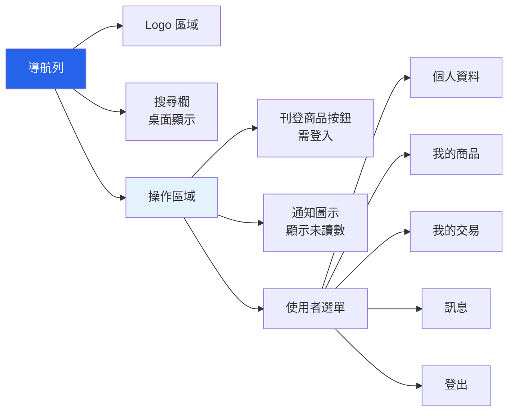

# StudentTrade 介面規格說明書

## 一、介面概述

### 1.1 設計理念

StudentTrade 的介面設計遵循以下原則：
- **簡潔直覺** - 清晰的視覺層級，易於理解
- **響應式設計** - 完美支援桌面、平板、手機
- **一致性** - 統一的色彩、字體、組件風格
- **無障礙** - 支援鍵盤導航和螢幕閱讀器
- **以使用者為中心** - 符合使用者習慣的操作流程

### 1.2 設計系統

**設計風格**: Modern Minimalist + Clean E-commerce 混合

**色彩方案**:
```
主色調（Primary）:   #2563EB (藍色) - 按鈕、連結、價格標示
  - Hover: #1D4ED8 (深藍)
  - Light: #DBEAFE (淡藍背景)

次要色（Secondary）: #64748B (灰色) - 文字、邊框
  - Dark: #1E293B (深灰文字)
  - Light: #F1F5F9 (淺灰背景)

成功色（Success）:   #10B981 (綠色) - 成功訊息、已售出標籤
警告色（Warning）:   #F59E0B (橘色) - 警告訊息、交易中標籤
錯誤色（Error）:     #EF4444 (紅色) - 錯誤訊息
特殊色（Accent）:    #EC4899 (粉紅) - 促銷、特價標籤

背景色:
  - 主背景: #FFFFFF (純白)
  - 次背景: #F9FAFB (淡灰) - 頁面底色
  - 卡片: #FFFFFF (白色 + 陰影)
```

**字體系統**:
```
標題字體: 'Noto Sans TC', sans-serif
內文字體: 'Noto Sans TC', sans-serif

字級（電商優化）:
- H1: 2rem (32px) - 頁面標題
- H2: 1.5rem (24px) - 區塊標題
- H3: 1.25rem (20px) - 卡片標題
- H4: 1.125rem (18px) - 小標題
- Body: 1rem (16px) - 正文
- Small: 0.875rem (14px) - 次要資訊
- Tiny: 0.75rem (12px) - 標籤、時間

字重:
- Regular: 400 - 正文
- Medium: 500 - 強調
- Semibold: 600 - 標題
- Bold: 700 - 價格、重要按鈕
```

**間距系統**:
```
使用 Tailwind 的間距 (4px 為基準):
- xs: 4px   - 緊密元素
- sm: 8px   - 小間距
- md: 16px  - 標準間距
- lg: 24px  - 區塊間距
- xl: 32px  - 大區塊
- 2xl: 48px - 區段分隔

卡片間距: 16px (md)
容器寬度: max-w-7xl (1280px)
```

**圓角系統**:
```
- 按鈕: 8px (rounded-lg)
- 卡片: 12px (rounded-xl)
- 輸入框: 6px (rounded-md)
- 標籤: 4px (rounded)
- 圖片: 8px (rounded-lg)
```

**陰影系統**:
```
- 卡片: shadow-md (0 4px 6px rgba(0,0,0,0.1))
- 卡片 Hover: shadow-lg (0 10px 15px rgba(0,0,0,0.1))
- 浮動按鈕: shadow-xl (0 20px 25px rgba(0,0,0,0.15))
- 下拉選單: shadow-2xl (0 25px 50px rgba(0,0,0,0.25))
```

---

## 二、全域組件

### 2.1 導航列（Navbar）

**設計規格**:
- 高度: 64px (桌面) / 56px (手機)
- 背景: #FFFFFF
- 陰影: shadow-md (提升層級感)
- Logo 字重: 600 (Semibold)
- 按鈕圓角: 8px (rounded-lg)

**桌面版視覺**:
```
┌─────────────────────────────────────────────────────────────────┐
│ 📚 StudentTrade    [🔍 搜尋商品...]     📝刊登商品  🔔(3)  王小明 ▼ │
│ (Semibold 20px)    (rounded-md)        (Primary Blue, rounded-lg) │
└─────────────────────────────────────────────────────────────────┘
```

**手機版視覺**:
```
┌───────────────────────────────┐
│ ☰  📚 StudentTrade       🔔(3) │
│    (Semibold 18px)            │
└───────────────────────────────┘
```

**Mermaid 組件結構**:


**狀態變化**:

| 狀態 | 顯示內容 |
|------|---------|
| **未登入** | Logo、搜尋欄、[登入] [註冊] 按鈕 |
| **已登入** | Logo、搜尋欄、刊登商品、通知、使用者選單 |
| **手機版** | 漢堡選單、Logo、通知圖示 |
| **搜尋中** | 顯示即時搜尋建議下拉選單 |

**互動行為**:
- 點擊 Logo → 導向首頁
- 輸入搜尋 → 即時顯示建議（延遲 300ms）
- 點擊通知 → 顯示通知下拉清單
- 點擊使用者名稱 → 顯示下拉選單
- 手機版點擊漢堡選單 → 展開側邊選單

---

### 2.2 頁尾（Footer）

**視覺設計**:
```
┌─────────────────────────────────────────────────────────────┐
│                    StudentTrade 校園二手平台                  │
│                                                             │
│  關於我們    使用條款    隱私權政策    聯絡我們              │
│                                                             │
│  © 2024 StudentTrade. All rights reserved.                 │
│  第十二組專題 - 林威辰、陳浚瑋、范哲瑋                        │
└─────────────────────────────────────────────────────────────┘
```

---

### 2.3 Flash 訊息組件

**成功訊息**:
```
┌────────────────────────────────────────┐
│ ✓ 商品刊登成功                          │
└────────────────────────────────────────┘
```

**錯誤訊息**:
```
┌────────────────────────────────────────┐
│ ✗ Email 已被註冊                        │
└────────────────────────────────────────┘
```

**警告訊息**:
```
┌────────────────────────────────────────┐
│ ⚠ 請先登入才能執行此操作                 │
└────────────────────────────────────────┘
```

**位置**: 固定於頁面頂部，導航列下方
**顯示時間**: 5 秒後自動消失，可手動關閉
**動畫**: 滑入效果（從上往下）

---

## 三、認證相關介面

### 3.1 登入頁面

**路徑**: `/auth/login`
**視覺設計**:

```
┌─────────────────────────────────────────────┐
│              導航列                          │
├─────────────────────────────────────────────┤
│                                             │
│                                             │
│         ┌───────────────────────┐          │
│         │  📚 StudentTrade      │          │
│         │                       │          │
│         │  歡迎回來              │          │
│         │                       │          │
│         │  電子郵件              │          │
│         │  [                  ] │          │
│         │                       │          │
│         │  密碼                  │          │
│         │  [                  ] │          │
│         │                       │          │
│         │  □ 記住我              │          │
│         │                       │          │
│         │  [     登入     ]     │          │
│         │                       │          │
│         │  還沒有帳號？          │          │
│         │  立即註冊 →            │          │
│         └───────────────────────┘          │
│                                             │
└─────────────────────────────────────────────┘
```

**表單設計規格**:
- 容器寬度: max-w-md (448px)
- 卡片圓角: 12px (rounded-xl)
- 卡片陰影: shadow-lg
- 輸入框圓角: 6px (rounded-md)
- 輸入框高度: 44px
- 按鈕圓角: 8px (rounded-lg)
- 按鈕高度: 44px
- 主按鈕背景: #2563EB
- 主按鈕 Hover: #1D4ED8

**表單欄位**:
| 欄位 | 類型 | 驗證規則 | 錯誤訊息 |
|------|------|---------|---------|
| 電子郵件 | email | 必填、Email 格式 | "請輸入有效的 Email" |
| 密碼 | password | 必填 | "請輸入密碼" |
| 記住我 | checkbox | 選填 | - |

**互動行為**:
1. 點擊「登入」→ 驗證表單
2. 驗證失敗 → 顯示錯誤訊息（紅色邊框 + 文字）
3. 驗證成功 → 提交表單 → 導向首頁
4. 點擊「立即註冊」→ 導向註冊頁

**錯誤狀態**:
```
電子郵件
[test@example.com        ] ✓

密碼
[••••••••                ] ✗
密碼錯誤，請重新輸入
```

---

### 3.2 註冊頁面

**路徑**: `/auth/register`
**視覺設計**:

```
┌─────────────────────────────────────────────┐
│              導航列                          │
├─────────────────────────────────────────────┤
│                                             │
│         ┌───────────────────────┐          │
│         │  建立新帳號            │          │
│         │                       │          │
│         │  使用者名稱 *          │          │
│         │  [                  ] │          │
│         │                       │          │
│         │  電子郵件 *            │          │
│         │  [                  ] │          │
│         │                       │          │
│         │  學號（選填）          │          │
│         │  [                  ] │          │
│         │                       │          │
│         │  手機號碼（選填）      │          │
│         │  [                  ] │          │
│         │                       │          │
│         │  密碼 *                │          │
│         │  [                  ] │          │
│         │  至少 8 個字元          │          │
│         │                       │          │
│         │  確認密碼 *            │          │
│         │  [                  ] │          │
│         │                       │          │
│         │  [     註冊     ]     │          │
│         │                       │          │
│         │  已有帳號？登入 →      │          │
│         └───────────────────────┘          │
│                                             │
└─────────────────────────────────────────────┘
```

**密碼強度指示器**:
```
密碼
[••••••••                ]
━━━━━━━━━━━━━━━━━━━━━━━
弱    中等    強
     ●
```

---

### 3.3 個人資料頁面

**路徑**: `/auth/profile`
**視覺設計**:

```
┌───────────────────────────────────────────────────────────┐
│                     導航列                                 │
├──────────────┬────────────────────────────────────────────┤
│              │                                            │
│  側邊選單     │         個人資料                           │
│              │                                            │
│ ● 個人資料   │    ┌──────────┐                           │
│ ○ 我的商品   │    │          │  [更換頭像]              │
│ ○ 我的交易   │    │   頭像    │                           │
│ ○ 訊息中心   │    │          │                           │
│ ○ 收到評價   │    └──────────┘                           │
│              │                                            │
│              │    使用者名稱 *                            │
│              │    [王小明                            ]   │
│              │                                            │
│              │    電子郵件 *                              │
│              │    [test@example.com              ]       │
│              │    (不可修改)                              │
│              │                                            │
│              │    學號                                    │
│              │    [A12345678                     ]       │
│              │                                            │
│              │    手機號碼                                │
│              │    [0912345678                    ]       │
│              │                                            │
│              │    [  取消  ]  [  儲存變更  ]             │
│              │                                            │
├──────────────┴────────────────────────────────────────────┤
│  ● 我的商品                                                │
│                                                           │
│  ┌─────────────────┐ ┌─────────────────┐                │
│  │ [圖片]          │ │ [圖片]          │                │
│  │ MacBook Pro     │ │ Python 教科書   │                │
│  │ NT$ 25,000      │ │ NT$ 300         │                │
│  │ 狀態：刊登中    │ │ 狀態：已售出    │                │
│  │ [編輯] [刪除]   │ │ [查看]          │                │
│  └─────────────────┘ └─────────────────┘                │
└───────────────────────────────────────────────────────────┘
```

**側邊選單標籤狀態**:
- **選中**: 藍色背景、白色文字、實心圓點
- **未選中**: 透明背景、灰色文字、空心圓點
- **Hover**: 淺灰背景

---

## 四、商品相關介面

### 4.1 首頁（商品列表）

**路徑**: `/` 或 `/products`
**視覺設計**:

```
┌───────────────────────────────────────────────────────────────┐
│                        導航列                                  │
├───────────────────────────────────────────────────────────────┤
│         分類快速導航                                           │
│  [📚 書籍] [✏️ 文具] [💻 電子] [🏠 生活] [⚽ 運動] [📦 其他]  │
├──────────────┬────────────────────────────────────────────────┤
│              │                                                │
│  篩選器      │        商品列表                                │
│              │                                                │
│ 分類         │  ┌───────┐ ┌───────┐ ┌───────┐ ┌───────┐    │
│ □ 書籍       │  │[圖片] │ │[圖片] │ │[圖片] │ │[圖片] │    │
│ □ 文具       │  │Mac    │ │Python │ │計算機 │ │筆記本 │    │
│ ☑ 電子產品   │  │$25000 │ │$300   │ │$500   │ │$50    │    │
│ □ 生活用品   │  │良好   │ │近全新 │ │普通   │ │全新   │    │
│              │  │1天前  │ │2天前  │ │3天前  │ │5天前  │    │
│ 價格範圍     │  └───────┘ └───────┘ └───────┘ └───────┘    │
│ [100] - [50k]│                                                │
│              │  ┌───────┐ ┌───────┐ ┌───────┐ ┌───────┐    │
│ 商品狀況     │  │[圖片] │ │[圖片] │ │[圖片] │ │[圖片] │    │
│ ☑ 全新       │  │滑鼠   │ │鍵盤   │ │耳機   │ │充電器 │    │
│ ☑ 近全新     │  │$300   │ │$500   │ │$800   │ │$200   │    │
│ ☑ 良好       │  └───────┘ └───────┘ └───────┘ └───────┘    │
│ □ 普通       │                                                │
│              │           [1] 2 3 4 5 ... 10  →                │
│ [套用篩選]   │                                                │
└──────────────┴────────────────────────────────────────────────┘
```

**商品卡片（放大）**:
```
┌──────────────────┐
│                  │
│    [商品圖片]     │  ← 1:1 正方形，rounded-lg (8px)
│                  │
├──────────────────┤
│ MacBook Pro 2020 │  ← 標題（最多 2 行，16px Medium）
│ NT$ 25,000       │  ← 價格（#2563EB、Bold 700、18px）
├──────────────────┤
│ 🏷️ 良好  📍 1天前 │  ← 狀況、時間（12px，#64748B）
└──────────────────┘
```

**卡片設計規格**:
- 背景: #FFFFFF
- 圓角: 12px (rounded-xl)
- 陰影: shadow-md
- Padding: 16px
- 間距: 16px gap

**卡片 Hover 效果**:
- 陰影: shadow-md → shadow-lg
- 位移: translateY(-2px)
- 過渡: 0.2s ease-in-out
- Border: 1px solid #DBEAFE (淡藍邊框)

**響應式網格**:
- 手機: 1 列
- 平板: 2 列
- 桌面: 3-4 列

---

### 4.2 商品詳情頁

**路徑**: `/products/<id>`
**視覺設計**:

```
┌─────────────────────────────────────────────────────────────────┐
│                          導航列                                  │
├─────────────────────────────────────────────────────────────────┤
│                                                                 │
│  首頁 > 電子產品 > MacBook Pro 2020                             │
│                                                                 │
├────────────────────┬────────────────────────────────────────────┤
│                    │                                            │
│   ┌──────────────┐ │  MacBook Pro 2020 13吋                    │
│   │              │ │  NT$ 25,000                               │
│   │              │ │  ──────────────────────                   │
│   │   主要圖片    │ │                                            │
│   │              │ │  商品狀況：● 良好                          │
│   │              │ │  商品分類：💻 電子產品                     │
│   │              │ │  上架時間：2024-11-28 14:30               │
│   └──────────────┘ │  瀏覽次數：42 次                           │
│                    │                                            │
│  [縮圖] [縮圖]     │  ──────────────────────                   │
│  [縮圖] [縮圖]     │                                            │
│                    │  商品描述                                  │
│  🔍 點擊放大       │  ────────                                  │
│                    │  2020 年購買，使用狀況良好，               │
│                    │  無刮痕，電池健康度 85%，                  │
│                    │  附原廠充電器與包裝盒。                    │
│                    │                                            │
│                    │  交換偏好                                  │
│                    │  ────────                                  │
│                    │  可交換 iPad 或同等價值商品                │
│                    │                                            │
│                    │  ──────────────────────                   │
│                    │                                            │
│                    │  [💬 聯繫賣家]  [🤝 發起交易]             │
│                    │                                            │
├────────────────────┴────────────────────────────────────────────┤
│                                                                 │
│  賣家資訊                                                        │
│  ────────                                                        │
│  ┌────┐                                                        │
│  │頭像│  王小明                                                 │
│  └────┘  ⭐⭐⭐⭐⭐ 4.8 (12 則評價)                         │
│          會員自：2024-01-15                                     │
│          [查看所有商品] [查看評價]                              │
│                                                                 │
├─────────────────────────────────────────────────────────────────┤
│                                                                 │
│  相似商品推薦                                                    │
│  ────────────                                                    │
│  ┌───────┐ ┌───────┐ ┌───────┐ ┌───────┐                     │
│  │[圖片] │ │[圖片] │ │[圖片] │ │[圖片] │                     │
│  │Mac    │ │iPad   │ │Mac    │ │Surface│                     │
│  │$20000 │ │$15000 │ │$30000 │ │$25000 │                     │
│  └───────┘ └───────┘ └───────┘ └───────┘                     │
└─────────────────────────────────────────────────────────────────┘
```

**圖片輪播功能**:
- 主圖顯示區域
- 下方縮圖導航（最多 5 張）
- 點擊縮圖切換主圖
- 支援鍵盤左右鍵切換
- 點擊主圖開啟 Lightbox 全螢幕檢視

**狀態標籤設計**:
```
[商品刊登中]   - 背景 #10B981, 文字白色, rounded (4px), px-3 py-1, 12px Bold
[交易中]       - 背景 #F59E0B, 文字白色, rounded (4px), px-3 py-1, 12px Bold
[已售出]       - 背景 #64748B, 文字白色, rounded (4px), px-3 py-1, 12px Bold
[特價]         - 背景 #EC4899, 文字白色, rounded (4px), px-3 py-1, 12px Bold
```

**按鈕設計規格**:
- 主要按鈕（發起交易）: 背景 #2563EB, 白色文字, rounded-lg, px-6 py-3, 16px Semibold
- 次要按鈕（聯繫賣家）: 邊框 #2563EB, 藍色文字, rounded-lg, px-6 py-3, 16px Semibold
- Hover 效果: 主按鈕背景變深 #1D4ED8, 次按鈕背景 #DBEAFE
- 禁用狀態: 背景 #E5E7EB, 文字 #9CA3AF, cursor-not-allowed

**按鈕狀態**:
| 情況 | 聯繫賣家按鈕 | 發起交易按鈕 |
|------|------------|------------|
| 未登入 | 提示「請先登入」 | 提示「請先登入」 |
| 已登入（非賣家） | 開啟訊息對話 | 顯示交易表單 |
| 已登入（是賣家） | 隱藏 | 隱藏 |
| 商品已售出 | 隱藏 | 隱藏 |

---

### 4.3 商品刊登/編輯頁面

**路徑**: `/products/new` 或 `/products/<id>/edit`
**視覺設計**:

```
┌─────────────────────────────────────────────────────────────┐
│                        導航列                                │
├─────────────────────────────────────────────────────────────┤
│                                                             │
│                     刊登新商品                               │
│                                                             │
│  ┌───────────────────────────────────────────────────────┐ │
│  │                                                       │ │
│  │  商品標題 *                                           │ │
│  │  [                                                  ] │ │
│  │  清楚描述商品名稱                                     │ │
│  │                                                       │ │
│  │  商品分類 *                                           │ │
│  │  [請選擇分類 ▼]                                       │ │
│  │                                                       │ │
│  │  商品描述 *                                           │ │
│  │  ┌───────────────────────────────────────────────┐   │ │
│  │  │                                               │   │ │
│  │  │  詳細說明商品狀況、購買時間、使用情況等...   │   │ │
│  │  │                                               │   │ │
│  │  └───────────────────────────────────────────────┘   │ │
│  │  至少 20 個字                                         │ │
│  │                                                       │ │
│  │  商品價格 * (NT$)                                     │ │
│  │  [                                                  ] │ │
│  │                                                       │ │
│  │  商品狀況 *                                           │ │
│  │  ◉ 全新  ○ 近全新  ○ 良好  ○ 普通                   │ │
│  │                                                       │ │
│  │  交換偏好（選填）                                     │ │
│  │  [可交換的物品說明...                              ] │ │
│  │                                                       │ │
│  │  商品圖片 * (最多 5 張)                               │ │
│  │  ┌────────────────────────────────────────────────┐  │ │
│  │  │ [+]                                            │  │ │
│  │  │ 點擊或拖曳上傳圖片                              │  │ │
│  │  │ 支援 JPG, PNG (最大 5MB)                       │  │ │
│  │  └────────────────────────────────────────────────┘  │ │
│  │                                                       │ │
│  │  已上傳圖片:                                          │ │
│  │  ┌──────┐ ┌──────┐ ┌──────┐                       │ │
│  │  │[預覽]│ │[預覽]│ │[預覽]│                       │ │
│  │  │ 主圖 │ │  ✗   │ │  ✗   │                       │ │
│  │  └──────┘ └──────┘ └──────┘                       │ │
│  │                                                       │ │
│  │  ─────────────────────────────────────────────────   │ │
│  │                                                       │ │
│  │          [  取消  ]      [  送出  ]                  │ │
│  │                                                       │ │
│  └───────────────────────────────────────────────────────┘ │
│                                                             │
└─────────────────────────────────────────────────────────────┘
```

**表單驗證**:

即時驗證（輸入時）:
- 標題: 長度 5-200 字元
- 描述: 至少 20 字元
- 價格: 正整數或小數
- 圖片: 格式（JPG/PNG）、大小（< 5MB）

提交驗證:
- 所有必填欄位都已填寫
- 至少上傳 1 張圖片
- 價格合理（> 0）

**圖片上傳區域設計**:
- 容器: border-2 border-dashed border-#64748B, rounded-xl
- 背景: #F9FAFB
- Padding: 48px
- Hover: border-#2563EB, 背景 #DBEAFE
- 拖曳中: border-#2563EB, 背景 #DBEAFE, border-solid

```
┌─────────────────────────────┐
│                             │
│         [+] 📷              │  ← Icon 32px, 顏色 #64748B
│                             │
│   點擊或拖曳上傳圖片         │  ← 16px Medium #1E293B
│   支援 JPG, PNG             │  ← 14px Regular #64748B
│   最大 5MB，最多 5 張        │
│                             │
└─────────────────────────────┘

拖曳時 (border-solid, #2563EB):
┌─────────────────────────────┐
│  ╔═══════════════════════╗  │
│  ║                       ║  │
│  ║    放開以上傳檔案      ║  ← 18px Semibold #2563EB
│  ║                       ║  │
│  ╚═══════════════════════╝  │
└─────────────────────────────┘
```

**圖片預覽卡片**:
```
┌──────────┐
│          │
│ [預覽圖] │
│          │
├──────────┤
│ ⭐ 設為主圖│
│ ✗ 刪除    │
└──────────┘
```

---

## 五、交易相關介面

### 5.1 交易列表頁

**路徑**: `/transactions`
**視覺設計**:

```
┌─────────────────────────────────────────────────────────────┐
│                        導航列                                │
├─────────────────────────────────────────────────────────────┤
│                                                             │
│                     我的交易                                 │
│                                                             │
│  [我是買家 (5)]  [我是賣家 (3)]                             │
│  ────────────                                               │
│                                                             │
│  篩選: [全部狀態 ▼]  [最新優先 ▼]                          │
│                                                             │
│  ┌───────────────────────────────────────────────────────┐ │
│  │ 交易 #123                                  [⏳ 待回應] │ │
│  ├───────────────────────────────────────────────────────┤ │
│  │ ┌────┐                                                │ │
│  │ │圖片│  MacBook Pro 2020                              │ │
│  │ └────┘  交易金額：NT$ 25,000                          │ │
│  │         賣家：王小明                                   │ │
│  │         發起時間：2024-11-29 10:30                    │ │
│  │                                                       │ │
│  │         備註：可以面交嗎？                             │ │
│  │                                                       │ │
│  │         [查看詳情]                                     │ │
│  └───────────────────────────────────────────────────────┘ │
│                                                             │
│  ┌───────────────────────────────────────────────────────┐ │
│  │ 交易 #122                                  [✅ 已完成] │ │
│  ├───────────────────────────────────────────────────────┤ │
│  │ ┌────┐                                                │ │
│  │ │圖片│  Python 程式設計                               │ │
│  │ └────┘  交易金額：NT$ 300                             │ │
│  │         賣家：李小華                                   │ │
│  │         完成時間：2024-11-28 15:20                    │ │
│  │                                                       │ │
│  │         [查看詳情]  [評價賣家]                        │ │
│  └───────────────────────────────────────────────────────┘ │
│                                                             │
│                    [1] 2 3 ... 5                            │
└─────────────────────────────────────────────────────────────┘
```

**狀態標籤設計規格**:
```
⏳ 待回應     - 背景 #FEF3C7, 文字 #F59E0B, border-#F59E0B, rounded, px-3 py-1, 12px Bold
✅ 已接受     - 背景 #DBEAFE, 文字 #2563EB, border-#2563EB, rounded, px-3 py-1, 12px Bold
✔️ 已完成     - 背景 #D1FAE5, 文字 #10B981, border-#10B981, rounded, px-3 py-1, 12px Bold
❌ 已取消     - 背景 #F1F5F9, 文字 #64748B, border-#64748B, rounded, px-3 py-1, 12px Bold
⚠️ 已拒絕     - 背景 #FEE2E2, 文字 #EF4444, border-#EF4444, rounded, px-3 py-1, 12px Bold
```

---

### 5.2 交易詳情頁

**路徑**: `/transactions/<id>`
**視覺設計**:

```
┌─────────────────────────────────────────────────────────────┐
│                        導航列                                │
├─────────────────────────────────────────────────────────────┤
│                                                             │
│  我的交易 > 交易 #123                                        │
│                                                             │
│  ┌───────────────────────────────────────────────────────┐ │
│  │                                                       │ │
│  │  交易狀態：⏳ 等待賣家回應                            │ │
│  │                                                       │ │
│  │  ─────────────────────────────────────────────       │ │
│  │                                                       │ │
│  │  交易資訊                                             │ │
│  │  ────────                                             │ │
│  │  交易編號：#123                                       │ │
│  │  發起時間：2024-11-29 10:30                          │ │
│  │  交易類型：購買                                       │ │
│  │  交易金額：NT$ 25,000                                │ │
│  │                                                       │ │
│  │  ─────────────────────────────────────────────       │ │
│  │                                                       │ │
│  │  商品資訊                                             │ │
│  │  ────────                                             │ │
│  │  ┌────┐                                              │ │
│  │  │圖片│  MacBook Pro 2020 13吋                       │ │
│  │  └────┘  分類：電子產品                              │ │
│  │          狀況：良好                                   │ │
│  │          [查看商品詳情]                               │ │
│  │                                                       │ │
│  │  ─────────────────────────────────────────────       │ │
│  │                                                       │ │
│  │  賣家資訊                                             │ │
│  │  ────────                                             │ │
│  │  ┌────┐                                              │ │
│  │  │頭像│  王小明                                       │ │
│  │  └────┘  評分：⭐⭐⭐⭐⭐ 4.8                      │ │
│  │          [發送訊息]                                   │ │
│  │                                                       │ │
│  │  ─────────────────────────────────────────────       │ │
│  │                                                       │ │
│  │  備註                                                 │ │
│  │  ────                                                 │ │
│  │  可以面交嗎？地點在台北？                             │ │
│  │                                                       │ │
│  │  ─────────────────────────────────────────────       │ │
│  │                                                       │ │
│  │  買家操作:                                            │ │
│  │  [取消交易]                                           │ │
│  │                                                       │ │
│  └───────────────────────────────────────────────────────┘ │
│                                                             │
└─────────────────────────────────────────────────────────────┘
```

**賣家視角（待回應狀態）**:
```
賣家操作:
[接受交易]  [拒絕交易]

拒絕理由（選填）:
[                                    ]
```

**雙方確認完成後**:
```
交易狀態：✅ 已完成

[對買家進行評價]
[對賣家進行評價]
```

---

## 六、訊息相關介面

### 6.1 訊息列表頁

**路徑**: `/messages`
**視覺設計**:

```
┌─────────────────────────────────────────────────────────────┐
│                        導航列                                │
├────────────────┬────────────────────────────────────────────┤
│                │                                            │
│  對話列表      │      選擇一個對話開始聊天                  │
│  ────────      │                                            │
│                │                                            │
│ ┌────────────┐ │              💬                           │
│ │🟢 張三      │ │                                            │
│ │關於 Mac... │ │      點擊左側對話查看訊息                  │
│ │5 分鐘前    │ │                                            │
│ └────────────┘ │                                            │
│                │                                            │
│ ┌────────────┐ │                                            │
│ │  李四 (2)  │ │                                            │
│ │可以面交嗎? │ │                                            │
│ │1 小時前    │ │                                            │
│ └────────────┘ │                                            │
│                │                                            │
│ ┌────────────┐ │                                            │
│ │  王五      │ │                                            │
│ │好的謝謝    │ │                                            │
│ │昨天        │ │                                            │
│ └────────────┘ │                                            │
│                │                                            │
└────────────────┴────────────────────────────────────────────┘
```

**對話列表項目狀態**:
```
未讀訊息:
┌────────────┐
│🟢 張三 (2) │  ← 綠點、粗體、未讀數
│新訊息...   │     藍色背景
│5 分鐘前    │
└────────────┘

已讀訊息:
┌────────────┐
│  李四      │  ← 無綠點、正常字重
│好的謝謝    │     白色背景
│昨天        │
└────────────┘
```

---

### 6.2 聊天介面

**路徑**: `/messages/<user_id>`
**視覺設計**:

```
┌─────────────────────────────────────────────────────────────┐
│                        導航列                                │
├────────────────┬────────────────────────────────────────────┤
│                │                                            │
│  對話列表      │  👤 張三                    [⋮ 更多]       │
│  ────────      │  ──────────────────────────────────        │
│                │                                            │
│ ┌────────────┐ │                                            │
│ │🟢 張三 (2) │ │  關於商品：MacBook Pro 2020                │
│ │新訊息...   │ │  ┌──────────────────────────────┐         │
│ │5 分鐘前    │ │  │ [商品圖片] MacBook Pro       │         │
│ └────────────┘ │  │ NT$ 25,000                   │         │
│                │  └──────────────────────────────┘         │
│ ┌────────────┐ │                                            │
│ │  李四      │ │                                            │
│ │可以面交嗎? │ │  ┌─────────────────────┐                 │
│ │1 小時前    │ │  │ 嗨，這個商品還在嗎？ │   對方           │
│ └────────────┘ │  └─────────────────────┘   10:30         │
│                │                                            │
│                │           ┌─────────────────────┐         │
│                │    我     │ 在的，歡迎詢問      │         │
│                │   10:32   └─────────────────────┘         │
│                │                                            │
│                │  ┌─────────────────────┐                 │
│                │  │ 可以面交嗎？        │   對方           │
│                │  └─────────────────────┘   10:35         │
│                │                                            │
│                │           ┌─────────────────────┐         │
│                │    我     │ 可以，台北車站方便嗎│         │
│                │   10:36   └─────────────────────┘         │
│                │                                            │
│                │  ──────────────────────────────────        │
│                │  [輸入訊息...                    ] [發送]  │
└────────────────┴────────────────────────────────────────────┘
```

**訊息氣泡設計規格**:

對方訊息（左側）:
- 背景: #F1F5F9
- 文字: #1E293B, 16px Regular
- 圓角: rounded-2xl rounded-tl-none (左上角直角)
- Padding: px-4 py-3
- 時間: 12px, #64748B
- Max-width: 70%

我的訊息（右側）:
- 背景: #2563EB
- 文字: #FFFFFF, 16px Regular
- 圓角: rounded-2xl rounded-tr-none (右上角直角)
- Padding: px-4 py-3
- 時間: 12px, #64748B
- Max-width: 70%

```
對方訊息（左側）:
┌─────────────────────┐
│ 訊息內容            │  #F1F5F9 背景, rounded-2xl
└─────────────────────┘
時間 (12px, #64748B)

我的訊息（右側）:
              ┌─────────────────────┐
              │ 訊息內容            │  #2563EB 背景, 白色文字
              └─────────────────────┘
                     時間 (12px, #64748B)
```

**商品資訊卡片**:
```
┌───────────────────────────────┐
│ ┌────┐                        │
│ │圖片│  MacBook Pro 2020      │
│ └────┘  NT$ 25,000            │
│         [查看商品]             │
└───────────────────────────────┘
```

**輸入框功能**:
- 支援多行輸入（自動擴展）
- Enter 發送，Shift+Enter 換行
- 表情符號選擇器（可選）
- 圖片上傳（可選）

---

## 七、評價相關介面

### 7.1 評價表單頁

**路徑**: `/reviews/new/<transaction_id>`
**視覺設計**:

```
┌─────────────────────────────────────────────────────────────┐
│                        導航列                                │
├─────────────────────────────────────────────────────────────┤
│                                                             │
│                    評價交易對象                              │
│                                                             │
│  ┌───────────────────────────────────────────────────────┐ │
│  │                                                       │ │
│  │  交易資訊                                             │ │
│  │  ────────                                             │ │
│  │  ┌────┐                                              │ │
│  │  │圖片│  MacBook Pro 2020                            │ │
│  │  └────┘  交易金額：NT$ 25,000                        │ │
│  │          完成時間：2024-11-29                        │ │
│  │                                                       │ │
│  │  ─────────────────────────────────────────────       │ │
│  │                                                       │ │
│  │  評價對象：王小明（賣家）                             │ │
│  │                                                       │ │
│  │  評分 *                                               │ │
│  │  ☆ ☆ ☆ ☆ ☆                                         │ │
│  │  點擊星星評分                                         │ │
│  │                                                       │ │
│  │  評價內容（選填）                                     │ │
│  │  ┌───────────────────────────────────────────────┐   │ │
│  │  │                                               │   │ │
│  │  │  說說你對這次交易的感受...                    │   │ │
│  │  │                                               │   │ │
│  │  └───────────────────────────────────────────────┘   │ │
│  │                                                       │ │
│  │  ─────────────────────────────────────────────       │ │
│  │                                                       │ │
│  │          [  稍後再說  ]      [  提交評價  ]          │ │
│  │                                                       │ │
│  └───────────────────────────────────────────────────────┘ │
│                                                             │
└─────────────────────────────────────────────────────────────┘
```

**星星評分互動**:
```
未選擇:
☆ ☆ ☆ ☆ ☆

Hover 3 星:
★ ★ ★ ☆ ☆

選擇 4 星:
★ ★ ★ ★ ☆
很好
```

**評分文字說明**:
- 1 星: 很不滿意
- 2 星: 不滿意
- 3 星: 普通
- 4 星: 很好
- 5 星: 非常好

---

### 7.2 評價列表頁

**路徑**: `/users/<id>/reviews`
**視覺設計**:

```
┌─────────────────────────────────────────────────────────────┐
│                        導航列                                │
├─────────────────────────────────────────────────────────────┤
│                                                             │
│  ┌────┐                                                    │
│  │頭像│  王小明的評價                                       │
│  └────┘  ⭐⭐⭐⭐⭐ 4.8 / 5.0 (12 則評價)              │
│                                                             │
│  ─────────────────────────────────────────────             │
│                                                             │
│  ┌───────────────────────────────────────────────────────┐ │
│  │ ⭐⭐⭐⭐⭐ 5.0                                       │ │
│  ├───────────────────────────────────────────────────────┤ │
│  │ 李小華                               2024-11-28      │ │
│  │ 交易：MacBook Pro 2020                                │ │
│  │                                                       │ │
│  │ 交易順利，賣家很好！東西狀況如描述，                   │ │
│  │ 推薦！                                                 │ │
│  └───────────────────────────────────────────────────────┘ │
│                                                             │
│  ┌───────────────────────────────────────────────────────┐ │
│  │ ⭐⭐⭐⭐ 4.0                                         │ │
│  ├───────────────────────────────────────────────────────┤ │
│  │ 張大明                               2024-11-25      │ │
│  │ 交易：Python 程式設計                                 │ │
│  │                                                       │ │
│  │ 不錯，書況良好。                                       │ │
│  └───────────────────────────────────────────────────────┘ │
│                                                             │
│                    [1] 2 3                                  │
└─────────────────────────────────────────────────────────────┘
```

---

## 八、錯誤與空狀態介面

### 8.1 404 錯誤頁面

**路徑**: 任意不存在的路徑
**視覺設計**:

```
┌─────────────────────────────────────────────┐
│              導航列                          │
├─────────────────────────────────────────────┤
│                                             │
│                                             │
│                  404                        │
│                                             │
│              找不到頁面                      │
│                                             │
│    抱歉，您訪問的頁面不存在                  │
│                                             │
│         [返回首頁]  [查看商品]              │
│                                             │
│                                             │
└─────────────────────────────────────────────┘
```

### 8.2 空狀態

**沒有商品時**:
```
┌─────────────────────────────────┐
│                                 │
│          📦                     │
│                                 │
│      目前沒有商品                │
│                                 │
│      [開始刊登商品]              │
│                                 │
└─────────────────────────────────┘
```

**沒有交易時**:
```
┌─────────────────────────────────┐
│                                 │
│          🤝                     │
│                                 │
│      目前沒有交易記錄            │
│                                 │
│      [瀏覽商品]                  │
│                                 │
└─────────────────────────────────┘
```

**沒有訊息時**:
```
┌─────────────────────────────────┐
│                                 │
│          💬                     │
│                                 │
│      還沒有訊息                  │
│                                 │
│      開始與賣家聊天吧！          │
│                                 │
└─────────────────────────────────┘
```

---

## 九、響應式設計

### 9.1 斷點設計

| 裝置 | 寬度 | 導航列 | 側邊欄 | 商品網格 |
|------|------|-------|--------|---------|
| 手機 | < 640px | 漢堡選單 | 隱藏 | 1 列 |
| 平板 | 640-1024px | 完整 | 可選 | 2-3 列 |
| 桌面 | > 1024px | 完整 | 顯示 | 3-4 列 |

### 9.2 手機版特殊設計

**底部導航列**（可選）:
```
┌─────────────────────────────────┐
│                                 │
│        頁面內容                  │
│                                 │
├─────────────────────────────────┤
│ [🏠首頁] [🔍搜尋] [➕刊登] [💬訊息] [👤我的] │
└─────────────────────────────────┘
```

**漢堡選單展開**:
```
┌───────────────────┐
│ ✗  選單           │
├───────────────────┤
│ 🏠 首頁           │
│ 🔍 搜尋商品       │
│ 📝 刊登商品       │
│ 💬 訊息           │
│ 🤝 我的交易       │
│ 👤 個人資料       │
│ 🚪 登出           │
└───────────────────┘
```

---

## 十、互動與動畫

### 10.1 頁面載入動畫

**骨架屏（Skeleton）**:
```
商品卡片載入中:
┌──────────────┐
│ ▓▓▓▓▓▓▓▓▓▓  │  ← 閃爍動畫
│ ▓▓▓▓▓▓▓▓▓▓  │
├──────────────┤
│ ▓▓▓▓▓▓      │
│ ▓▓▓▓        │
└──────────────┘
```

### 10.2 按鈕狀態

**按鈕狀態設計規格**:
```
Primary Button (主要按鈕):
Normal:   背景 #2563EB, 白色文字, rounded-lg, shadow-md
Hover:    背景 #1D4ED8, shadow-lg, translateY(-1px)
Active:   背景 #1E40AF, shadow-sm, scale(0.98)
Disabled: 背景 #E5E7EB, 文字 #9CA3AF, cursor-not-allowed, 無陰影
Loading:  背景 #2563EB, [⏳ 處理中], 禁用點擊

Secondary Button (次要按鈕):
Normal:   邊框 #2563EB, 文字 #2563EB, 白色背景, rounded-lg
Hover:    背景 #DBEAFE, 邊框 #1D4ED8
Active:   背景 #BFDBFE, scale(0.98)
Disabled: 邊框 #E5E7EB, 文字 #9CA3AF, cursor-not-allowed

過渡時間: 0.2s ease-in-out
```

### 10.3 過渡效果

- 頁面切換: 淡入淡出 (0.2s)
- 卡片 Hover: 陰影 + 位移 (0.2s)
- 下拉選單: 滑入 (0.15s)
- Modal 開啟: 縮放 + 淡入 (0.3s)

---

## 十一、總結

### 11.1 介面清單

| 類別 | 介面數量 | 狀態 |
|------|---------|------|
| 認證介面 | 3 個 | 已規劃 |
| 商品介面 | 4 個 | 已規劃 |
| 交易介面 | 2 個 | 已規劃 |
| 訊息介面 | 2 個 | 已規劃 |
| 評價介面 | 2 個 | 已規劃 |
| 錯誤介面 | 3 個 | 已規劃 |
| **總計** | **16 個** | **完成** |

### 11.2 設計資源

**Figma 原型**（建議）:
- 完整的視覺設計稿
- 互動原型
- 設計規範文檔

**圖示資源**:
- Heroicons (https://heroicons.com/)
- Font Awesome (https://fontawesome.com/)
- 表情符號（Emoji）

**字體**:
- Noto Sans TC (Google Fonts)
- 思源黑體（本地備援）

### 11.3 下一步

1. 依照 [05-frontend-design.md](./05-frontend-design.md) 實作 HTML 模板
2. 使用 Tailwind CSS 套用本文檔的設計
3. 實作互動功能（JavaScript）
4. 進行使用者測試並優化

---

**本文檔涵蓋了 StudentTrade 所有主要介面的視覺設計與互動規格，可作為前端開發的完整參考。**
