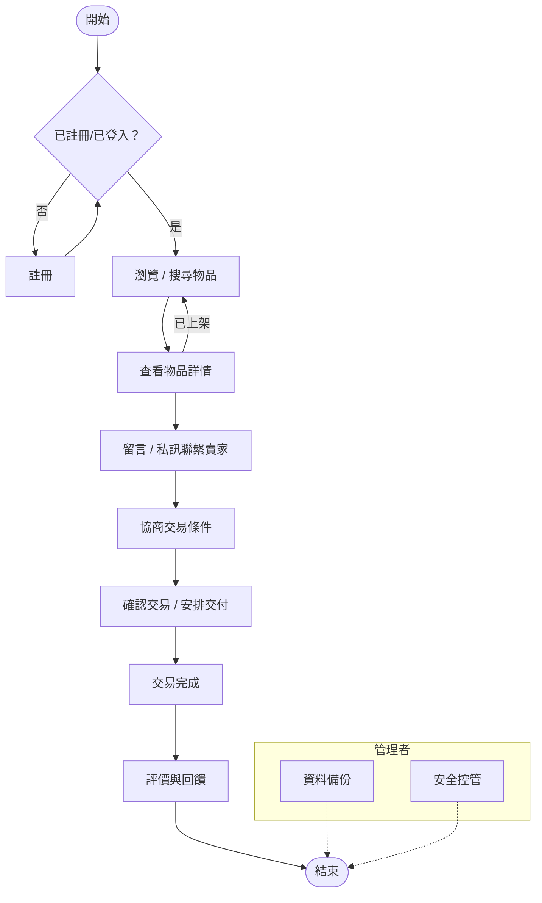

# HW3 — StudentTrade 校園二手物品交換平台

## 🧩 第十二組
**組長:** 林威辰  
**組員:** 陳浚瑋、范哲瑋  

---

## 👥 組員分工

| 職務 | 姓名 | 主要任務 |
|------|------|-----------|
| 系統分析師 | 陳浚瑋 | 企業個案、需求分析、SWOT、DFD |
| 系統設計師 | 范哲瑋 | 架構設計、ERD、介面原型 |
| 系統實作與測試負責人 | 林威辰 | 雛型開發、測試案例、成果展示 |

---

## 📖 專題簡介

**StudentTrade** 是一個「校園二手物品交換與交易平台」，  
提供學生在校園內進行二手物品的上架、搜尋、交換與交易。  
支援書籍、文具、電子產品與生活用品等，並具備會員註冊、搜尋、留言 / 聯繫功能。  
三人分工，涵蓋前端、後端、資料庫與文件。

---

## ⚙️ 功能性需求（Functional Requirements）

1. 使用者可註冊帳號並登入系統，以建立個人交易身份。  
2. 使用者可上架二手物品，包含名稱、分類、價格、狀況及交換條件。  
3. 使用者可瀏覽、搜尋及篩選他人上架的物品。  
4. 使用者可留言或私訊其他使用者進行交易溝通。  
5. 使用者可編輯或刪除自己上架的物品。  

---

## 🧱 非功能性需求（Non-Functional Requirements）

1. 系統介面需支援桌機與手機版（RWD）。  
2. 系統需具備帳號安全機制（密碼加密）。  
3. 平台介面應簡潔直覺，提升使用者體驗。  
4. 交易流程與查詢速度需在 3 秒內完成回應。  
5. 系統資料需每日自動備份至伺服器。  

---

## 🗂 功能分解圖（Functional Decomposition Diagram, FDD）

```

StudentTrade 平台
├── 使用者管理
│   ├── 註冊帳號
│   ├── 登入 / 登出
│   └── 個人資料管理
├── 物品管理
│   ├── 新增物品
│   ├── 編輯 / 下架物品
│   └── 瀏覽所有物品
├── 搜尋與篩選
│   ├── 關鍵字搜尋
│   ├── 類別篩選
│   └── 價格範圍篩選
├── 交易互動
│   ├── 留言功能
│   ├── 私訊聯繫
│   └── 評價與回饋
└── 系統維護
├── 資料備份
└── 安全控管

```

---

## 🎭 使用案例圖（Use Case Diagram）

---

## 📘 使用案例說明（Use Case Descriptions）

### Use Case 1：註冊帳號  
- **主要參與者：** 學生使用者  
- **前置條件：** 使用者尚未註冊帳號  
- **主要流程：**  
  1. 使用者輸入帳號、密碼、Email。  
  2. 系統驗證格式並建立新帳號。  
  3. 顯示「註冊成功」訊息。  

---

### Use Case 2：上架物品  
- **主要參與者：** 學生使用者  
- **前置條件：** 使用者已登入系統  
- **主要流程：**  
  1. 使用者輸入物品資訊（名稱、分類、價格、描述）。  
  2. 系統儲存資料並顯示上架成功。  
  3. 物品顯示於「可交易清單」。  

---

### Use Case 3：搜尋與聯繫  
- **主要參與者：** 學生使用者  
- **前置條件：** 系統中已有上架物品  
- **主要流程：**  
  1. 使用者輸入關鍵字或選擇分類。  
  2. 系統顯示符合條件的物品。  
  3. 使用者點選物品進入頁面並留言聯繫賣家。  

---

## 📅 專題流程（簡略版）

1. 初步調查 & 系統請求 → 系統分析師  
2. 可行性研究 & SWOT → 系統分析師  
3. 需求模型（Use Case、DFD）→ 系統分析師  
4. 資料庫 & 系統架構設計 → 系統設計師  
5. 介面原型 & ERD → 系統設計師  
6. 系統雛型開發 & 測試 → 系統實作人  
7. 文件整理 & 簡報展示 → 三人共同完成  
