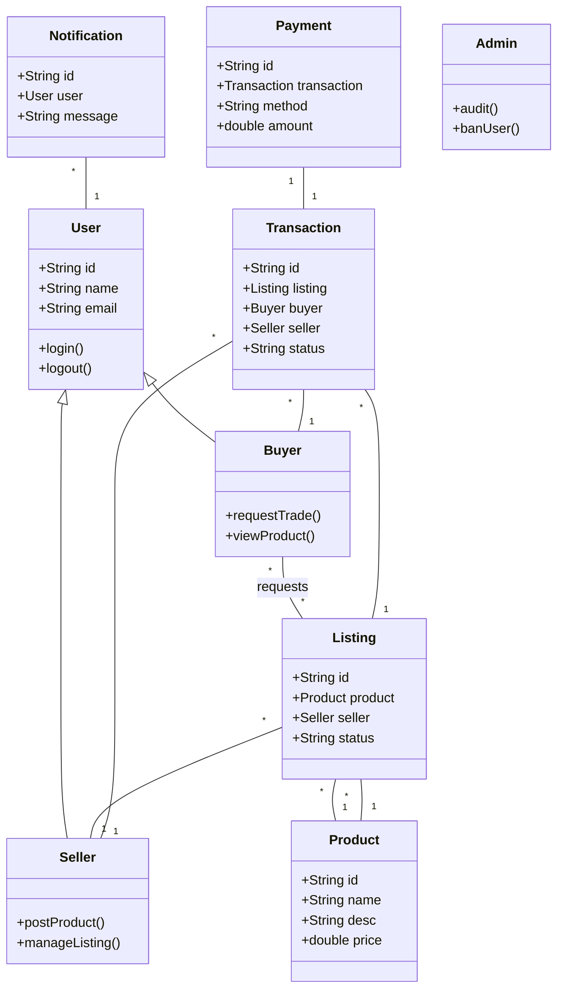
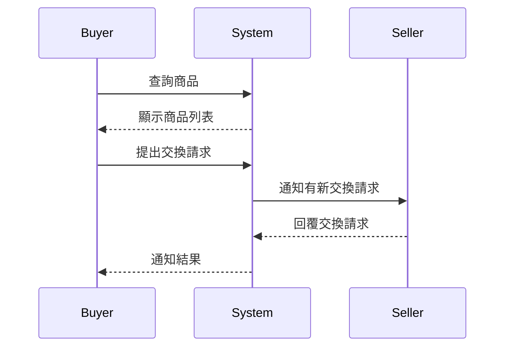
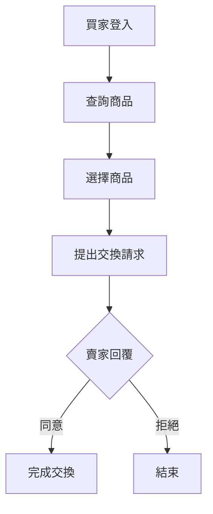
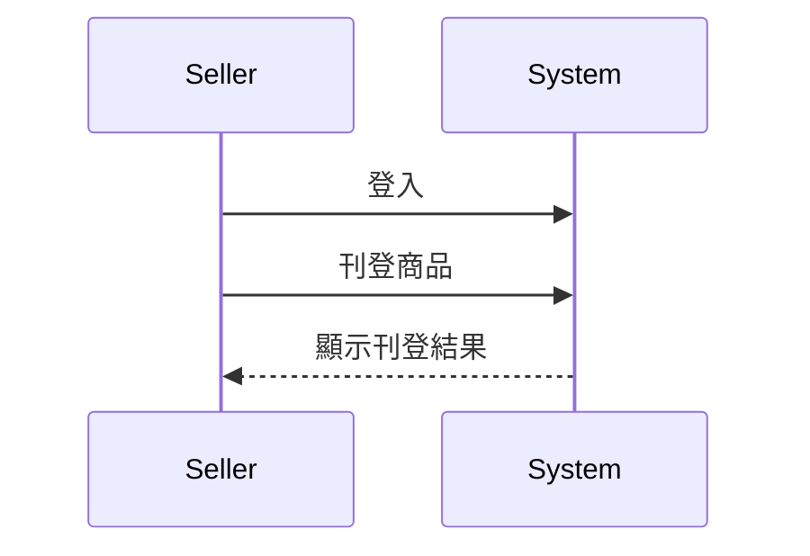
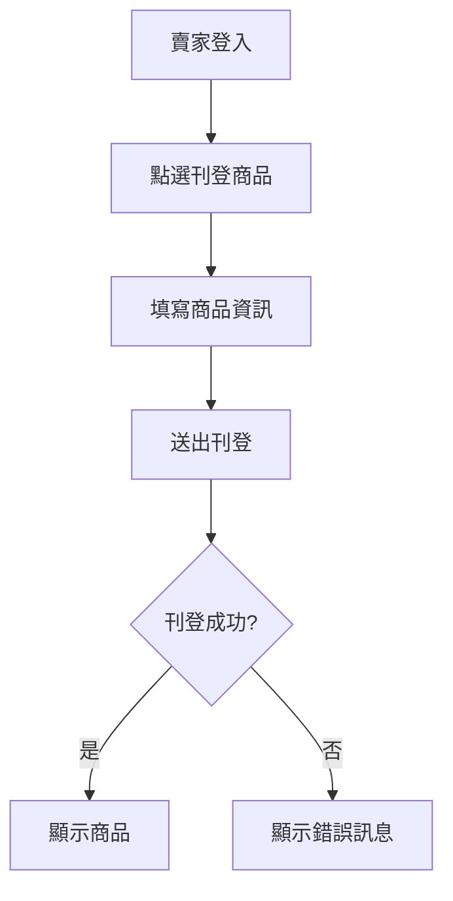
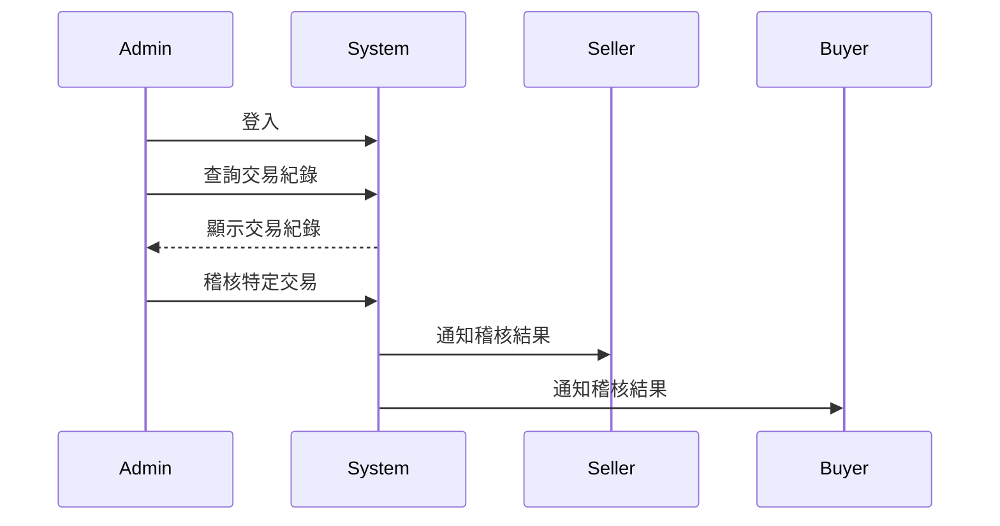
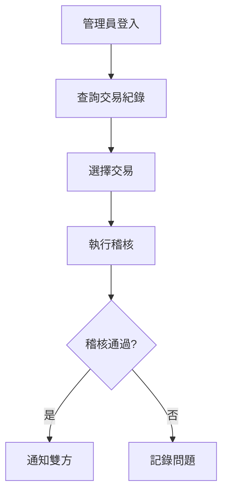

## UML 類別圖（Class Diagram）

```mermaid
classDiagram
    User <|-- Buyer
    User <|-- Seller
    Admin
    Product "1" -- "*" Listing
    Listing "*" -- "1" Seller
    Listing "*" -- "1" Product
    Buyer "*" -- "*" Listing : requests
    Transaction "*" -- "1" Listing
    Transaction "*" -- "1" Buyer
    Transaction "*" -- "1" Seller
    Payment "1" -- "1" Transaction
    Notification "*" -- "1" User
    class User {
        +String id
        +String name
        +String email
        +login()
        +logout()
    }
    class Buyer {
        +requestTrade()
        +viewProduct()
    }
    class Seller {
        +postProduct()
        +manageListing()
    }
    class Admin {
        +audit()
        +banUser()
    }
    class Product {
        +String id
        +String name
        +String desc
        +double price
    }
    class Listing {
        +String id
        +Product product
        +Seller seller
        +String status
    }
    class Transaction {
        +String id
        +Listing listing
        +Buyer buyer
        +Seller seller
        +String status
    }
    class Payment {
        +String id
        +Transaction transaction
        +String method
        +double amount
    }
    class Notification {
        +String id
        +User user
        +String message
    }
```

---

## 使用案例與循序圖、活動圖

### 使用案例 1：買家瀏覽商品並提出交換請求

#### 循序圖

```mermaid
sequenceDiagram
    participant Buyer
    participant System
    participant Seller
    Buyer->>System: 查詢商品
    System-->>Buyer: 顯示商品列表
    Buyer->>System: 提出交換請求
    System->>Seller: 通知有新交換請求
    Seller-->>System: 回覆交換請求
    System-->>Buyer: 通知結果
```

#### 活動圖

```mermaid
flowchart TD
    A[買家登入] --> B[查詢商品]
    B --> C[選擇商品]
    C --> D[提出交換請求]
    D --> E{賣家回覆}
    E -- 同意 --> F[完成交換]
    E -- 拒絕 --> G[結束]
```

---

### 使用案例 2：賣家刊登商品

#### 循序圖

```mermaid
sequenceDiagram
    participant Seller
    participant System
    Seller->>System: 登入
    Seller->>System: 刊登商品
    System-->>Seller: 顯示刊登結果
```

#### 活動圖

```mermaid
flowchart TD
    A[賣家登入] --> B[點選刊登商品]
    B --> C[填寫商品資訊]
    C --> D[送出刊登]
    D --> E{刊登成功?}
    E -- 是 --> F[顯示商品]
    E -- 否 --> G[顯示錯誤訊息]
```

---

### 使用案例 3：管理員稽核交易

#### 循序圖

```mermaid
sequenceDiagram
    participant Admin
    participant System
    participant Seller
    participant Buyer
    Admin->>System: 登入
    Admin->>System: 查詢交易紀錄
    System-->>Admin: 顯示交易紀錄
    Admin->>System: 稽核特定交易
    System->>Seller: 通知稽核結果
    System->>Buyer: 通知稽核結果
```

#### 活動圖

```mermaid
flowchart TD
    A[管理員登入] --> B[查詢交易紀錄]
    B --> C[選擇交易]
    C --> D[執行稽核]
    D --> E{稽核通過?}
    E -- 是 --> F[通知雙方]
    E -- 否 --> G[記錄問題]
```
