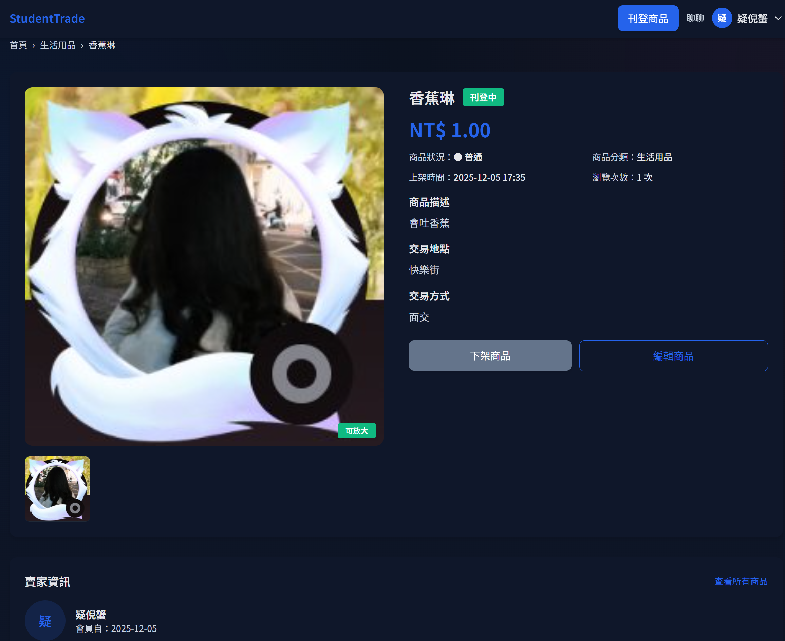
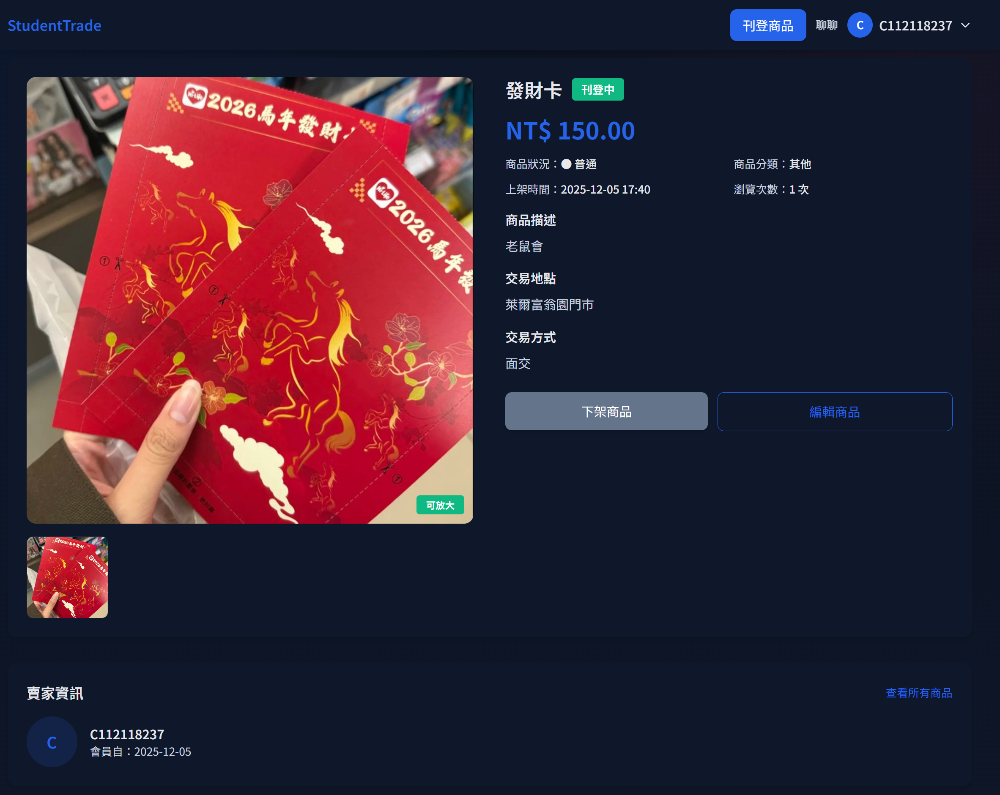
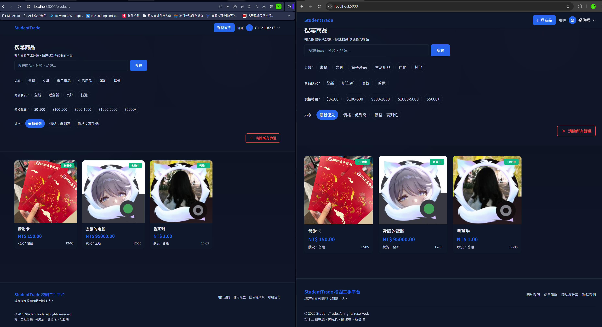
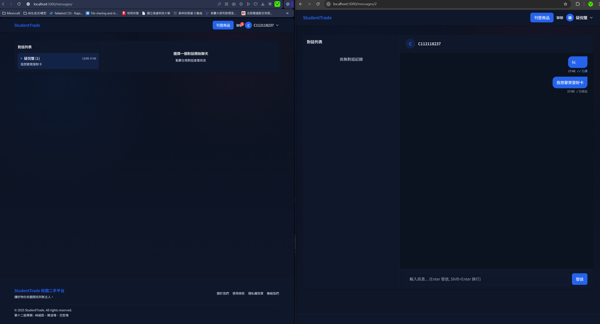

## StudentTrade 二手交易平台分鏡圖

### 故事概述
學生社群需要一個安全又方便的二手交換平台。「StudentTrade」的核心情境是：買家瀏覽不同賣家的商品詳情、比較後決定想要的商品，最後透過站內聊天室與賣家確認交易細節。本作業依照實際介面截圖整理四格分鏡，描述角色、動機、操作與系統回饋。

### 主要角色
- **買家 C112118237**：想用面交方式購買合適的生活用品或收藏品。
- **賣家 疑倪蟹 / C112118237**：刊登實體商品、等待聊天通知並決定是否同意交易。
- **StudentTrade 平台**：提供商品瀏覽、搜尋、即時訊息與權限控管等功能。

### 分鏡

#### 畫面 1：香蕉琳商品詳情

買家點開「香蕉琳」頁面確認商品狀態、交易方式與是否仍在架上，滑動檢視主圖並可隨時點擊「聯聊」或返回列表。頁面同步顯示賣家暱稱、刊登時間、交易地點（快樂街）、商品分類與下架/編輯按鈕，維持資訊透明。

#### 畫面 2：發財卡商品詳情

同一位用戶切換到「發財卡」刊登，檢查高價收藏品的描述與照片是否正確，若需要就透過「編輯商品」調整。系統提供 NT$150 價格、商品狀態、分類與賣家會員資料，並更新列表縮圖，讓買家建立信任。

#### 畫面 3：搜尋與排序列表

買家回到搜尋頁面，在兩個視窗中比較不同瀏覽器與排序設定，透過分類、價格區間與排序標籤快速篩選想要的商品。輸入關鍵字、設定價格後按「搜尋」，系統即時刷新卡片並顯示「發財卡」、「靈韻的置顯」、「香蕉琳」等項目，以及狀態、新舊程度與上架日期，方便比價。

#### 畫面 4：站內聊天室

買家決定面交「發財卡」，切換到聊天室查看與賣家的對話紀錄。左側清單顯示所有對談，右側是訊息內容；買家輸入「我想買發財卡」後按 Enter 或點送出。訊息氣泡會標示已讀狀態，提醒買家是否仍在等回覆，維持交易流程透明。

### 資訊與互動重點
- **一致的視覺語言**：四格介面皆維持暗色主題、清楚的字體與按鈕樣式，幫助使用者在不同流程間不迷路。
- **資料透明**：詳細頁面揭露價格、狀態、地點、類別；搜索列與篩選條件保持在視野頂部，減少重複操作。
- **跨流程串接**：商品詳情 → 搜尋結果 → 聊天室形成完整旅程，顯示平台如何讓買家做決策並與賣家互動。
- **後續可能的介面改善**：可加入「收藏」或「提醒」按鈕，並在聊天室內顯示商品摘要，讓使用者不需切換頁面即可掌握交易物件。
