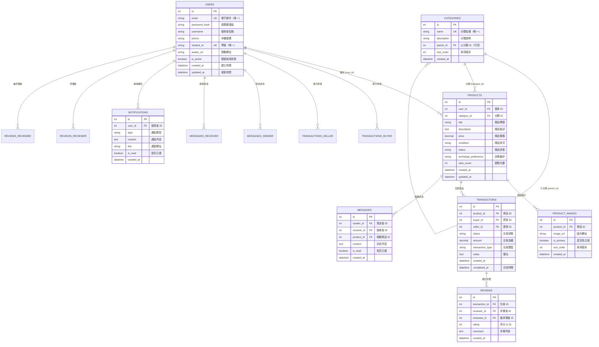

## 二、實體關係圖 (ERD)

### 2.1 完整 ERD

```mermaid
erDiagram
    USERS ||--o{ PRODUCTS : "擁有 (user_id)"
    USERS ||--o{ TRANSACTIONS_BUYER : "買方參與"
    USERS ||--o{ TRANSACTIONS_SELLER : "賣方參與"
    USERS ||--o{ MESSAGES_SENDER : "發送訊息"
    USERS ||--o{ MESSAGES_RECEIVER : "接收訊息"
    USERS ||--o{ NOTIFICATIONS : "接收通知"
    USERS ||--o{ REVIEWS_REVIEWER : "評價者"
    USERS ||--o{ REVIEWS_REVIEWEE : "被評價者"

    CATEGORIES ||--o{ CATEGORIES : "子分類 (parent_id)"
    CATEGORIES ||--o{ PRODUCTS : "分類 (category_id)"

    PRODUCTS ||--o{ PRODUCT_IMAGES : "商品圖片"
    PRODUCTS ||--o{ TRANSACTIONS : "交易商品"
    PRODUCTS ||--o{ MESSAGES : "相關訊息"

    TRANSACTIONS ||--o{ REVIEWS : "產生評價"

    USERS {
        int id PK
        string email UK "電子郵件（唯一）"
        string password_hash "密碼雜湊值"
        string username "使用者名稱"
        string phone "手機號碼"
        string student_id UK "學號（唯一）"
        string avatar_url "頭像網址"
        boolean is_active "帳號啟用狀態"
        datetime created_at "建立時間"
        datetime updated_at "更新時間"
    }

    CATEGORIES {
        int id PK
        string name UK "分類名稱（唯一）"
        string description "分類說明"
        int parent_id FK "父分類 ID（可空）"
        int sort_order "排序順序"
        datetime created_at
    }

    PRODUCTS {
        int id PK
        int user_id FK "賣家 ID"
        int category_id FK "分類 ID"
        string title "商品標題"
        text description "商品描述"
        decimal price "商品價格"
        string condition "商品狀況"
        string status "商品狀態"
        string exchange_preference "交換偏好"
        int view_count "瀏覽次數"
        datetime created_at
        datetime updated_at
    }

    PRODUCT_IMAGES {
        int id PK
        int product_id FK "商品 ID"
        string image_url "圖片網址"
        boolean is_primary "是否為主圖"
        int sort_order "排序順序"
        datetime created_at
    }

    TRANSACTIONS {
        int id PK
        int product_id FK "商品 ID"
        int buyer_id FK "買家 ID"
        int seller_id FK "賣家 ID"
        string status "交易狀態"
        decimal amount "交易金額"
        string transaction_type "交易類型"
        text notes "備註"
        datetime created_at
        datetime completed_at "完成時間"
    }

    MESSAGES {
        int id PK
        int sender_id FK "發送者 ID"
        int receiver_id FK "接收者 ID"
        int product_id FK "相關商品 ID"
        text content "訊息內容"
        boolean is_read "是否已讀"
        datetime created_at
    }

    NOTIFICATIONS {
        int id PK
        int user_id FK "使用者 ID"
        string type "通知類型"
        text content "通知內容"
        string link "連結網址"
        boolean is_read "是否已讀"
        datetime created_at
    }

    REVIEWS {
        int id PK
        int transaction_id FK "交易 ID"
        int reviewer_id FK "評價者 ID"
        int reviewee_id FK "被評價者 ID"
        int rating "評分 (1-5)"
        text comment "評價內容"
        datetime created_at
    }
```