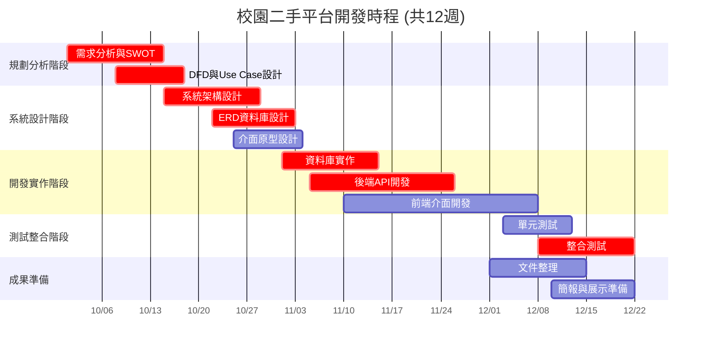
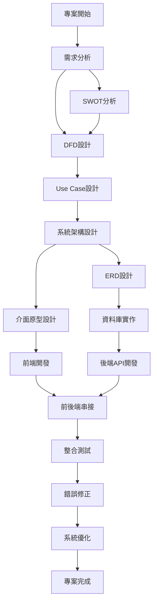
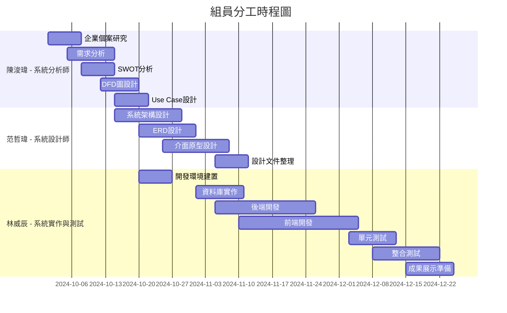

# 甘特圖

```mermaid
gantt
    title 校園二手平台開發時程 (共12週)
    dateFormat  YYYY-MM-DD
    axisFormat  %m/%d
    section 規劃分析階段
    需求分析與SWOT       :crit, 2024-10-01, 14d
    DFD與Use Case設計   :crit, 2024-10-08, 10d
    
    section 系統設計階段
    系統架構設計         :crit, 2024-10-15, 14d
    ERD資料庫設計        :crit, 2024-10-22, 12d
    介面原型設計         :2024-10-25, 10d
    
    section 開發實作階段
    資料庫實作          :crit, 2024-11-01, 14d
    後端API開發         :crit, 2024-11-05, 21d
    前端介面開發         :2024-11-10, 28d
    
    section 測試整合階段
    單元測試           :2024-12-03, 10d
    整合測試           :crit, 2024-12-08, 14d
    
    section 成果準備
    文件整理           :2024-12-01, 14d
    簡報與展示準備      :2024-12-10, 12d
```
# PERT/CPM 圖

```mermaid
graph TD
    A[專案開始] --> B[需求分析]
    B --> C[SWOT分析]
    B --> D[DFD設計]
    C --> D
    D --> E[Use Case設計]
    E --> F[系統架構設計]
    F --> G[ERD設計]
    F --> H[介面原型設計]
    G --> I[資料庫實作]
    H --> J[前端開發]
    I --> K[後端API開發]
    J --> L[前後端串接]
    K --> L
    L --> M[整合測試]
    M --> N[錯誤修正]
    N --> O[系統優化]
    O --> P[專案完成]
```
# 工作分配

```mermaid
gantt
    title 組員分工時程圖
    dateFormat  YYYY-MM-DD
    
    section 陳浚瑋 - 系統分析師
    企業個案研究       :2024-10-01, 7d
    需求分析           :2024-10-05, 10d
    SWOT分析          :2024-10-08, 7d
    DFD圖設計         :2024-10-12, 8d
    Use Case設計      :2024-10-15, 7d
    
    section 范哲瑋 - 系統設計師
    系統架構設計       :2024-10-15, 14d
    ERD設計           :2024-10-20, 12d
    介面原型設計       :2024-10-25, 14d
    設計文件整理       :2024-11-05, 7d
    
    section 林威辰 - 系統實作與測試
    開發環境建置      :2024-10-20, 7d
    資料庫實作        :2024-11-01, 10d
    後端開發          :2024-11-05, 21d
    前端開發          :2024-11-10, 25d
    單元測試          :2024-12-03, 10d
    整合測試          :2024-12-08, 14d
    成果展示準備      :2024-12-15, 10d
```
